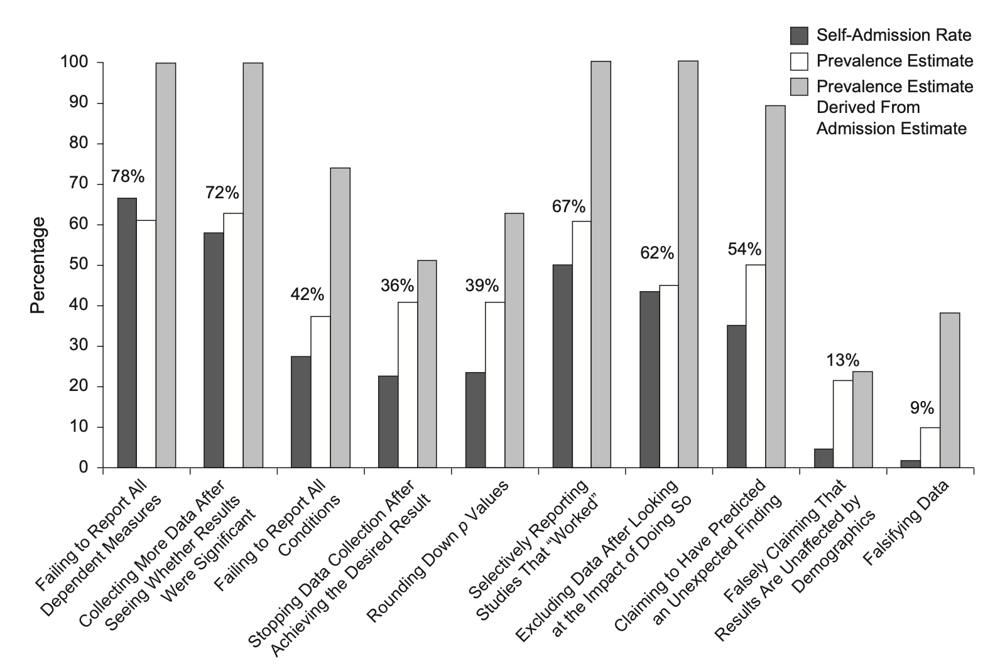
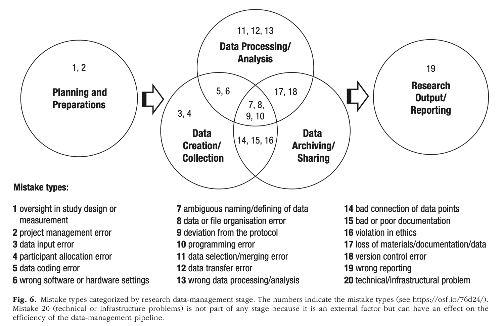

# (PART) Introduction {-} 

# What is Open Science?


```{r setup01, include=FALSE}
knitr::opts_chunk$set(echo = TRUE, collapse=TRUE, tidy.opts=list(width.cutoff=60),
                      warning=FALSE, message=FALSE, tidy=F)
```


<div style="margin-bottom:40px;">
</div>


><center><h1 style="font-size:160%; color: #000000">**LEARNING OUTCOMES**</h1></center>
><div style="margin-bottom:30px;">
></div>
>- Identify and explain Open Science's principles.
>- Compare the different initiatives promoting Open Science nationally and internationally.
>- Appraise the implications of using Open Science's principles of reproducibility, openness, and replicability in the research process.
>- Apply Open Science to comply with the regulations of research institutions and funders, governments, and publishers.
>- Identify the steps required and implement the best practices to promote data sharing, open code and software, and data curation.


<div style="margin-bottom:70px;">
</div>


According to the 2021 United Nations Educational, Scientific and Cultural Organization (UNESCO) Recommendation on Open Science, "... **Open  Science**  is  defined  as  an  inclusive construct that combines various movements and practices aiming to  make  multilingual  scientific  knowledge  openly  available,  accessible  and  reusable  for  everyone,  to  increase  scientific  collaborations  and  sharing  of  information for the benefits of science and society, and to open the processes of scientific knowledge creation, evaluation and communication to societal actors beyond the traditional scientific community. It comprises all scientific disciplines and aspects of scholarly  practices, including basic and applied sciences, natural and social sciences and the humanities, and it builds on the following key pillars: open scientific knowledge, open science infrastructures, science communication open engagement o societal actors and open dialogue with other knowledge systems." (2017, p. 7)

For The European Commission's task force on Research and Innovation (2021), "**Open Science** is a system change allowing for better science through open and collaborative ways of producing and sharing knowledge and data, as early as possible in the research process, and for communicating and sharing results. This new approach affects research institutions and science practices by bringing about new ways of funding, evaluating, and rewarding researchers. Open Science increases the quality and impact of science by fostering reproducibility and interdisciplinarity. It makes science more efficient through better sharing of resources, more reliable through better verification and more responsive to society’s needs" (p. 1)

In the United Kingdom, different regulations on open science (also named *Open Research* or *Open Scholarship*) has been developed. For example, the [2019 Concordat to Support Research Integrity (Universities UK)](https://www.universitiesuk.ac.uk/topics/research-and-innovation/concordat-support-research-integrity){target="_blank"} or the [2016 Concordat on Open Research Data (HEFCE, Research Councils UK, Wellcome Trust, Universities UK)](https://www.ukri.org/wp-content/uploads/2020/10/UKRI-020920-ConcordatonOpenResearchData.pdf){target="_blank"} have captured some of the initiatives on Open Science discussed and developed by other policy makers, institutions, publishers, funders, and research councils. It is important to note that the [UK Reproducibility Network](https://www.ukrn.org){target="_blank"}---supported by UK Research Institute, the British Psychological Society, Wellcome Trust, Cancer Research UK, UK Data Service, or Universities UK---has played a pivotal role in "seeking to understand the factors that contribute to poor research reproducibility and replicability, and to develop approaches to counter these and improve the quality of the research we produce" (UK Reproducibility Network, 2021, p. 1).


<div style="margin-bottom:40px;">
</div>

<div class="alert alert-success" role="alert">
  <h4 class="alert-heading" style="text-align: center; color: DarkRed">**Open Science**</h4>
  <p style="color: Black">**Open Science** is a broad term used to encompass the promotion of *transparency*, *reproducibility*, *research integrity*, and *societal impact (research and innovation)*.</p>
  <p style="color: Black">Because of those principles, **Open Science** can be reconceived as a meta-scientific movement interested in enhancing the following skills:</p>
  <ul><ul type = 'square' style="color: Black">
<li>Digital content creation</li>
<li>Science communication</li>
<li>Information and data literacy</li>
  <ul></ul>
</div>


<div style="margin-bottom:60px;">
</div>


To empower researchers at every career stage, different organizations and Higher Education institutions have launched innovative educational programes along with institutional statements and strategies to promote Open Science best practices. For example, [the University of Sheffield](https://www.sheffield.ac.uk/openresearch/university-statement-open-research){target="_blank"} has launched an Open Science strategy to promote a culture of research excellence. [The University of Manchester](https://www.openresearch.manchester.ac.uk){target="_blank"} has created the Office for Open Research led big five strategic priorities: (1) open research skills, (2) open research communities, (3) open research recognition, (4) open research workflows, and (5) open and FAIR research outputs. Similarly, [the University of Surrey](https://www.surrey.ac.uk/sites/default/files/2022-02/open-research-strategic-goals-and-action-plan-2019-2024.pdf){target="_blank"} developed a 5-year open research strategic goals and action plan that emphasizes the awareness, training and advocacy of open practice across the university in research, teaching, and learning.

In December 2021, [Loughborough University](https://repository.lboro.ac.uk/articles/online_resource/Loughborough_University_Open_Research_Position_Statement/11709975){target="_blank"} published an Open Research Position Statement to develop, review, and promote an institutional policy framework for Open Research. Echoing the University of Manchester's strategic priorities, Loughborough University has emphasized the pivotal role of training and support for PhD students and senior academics to update their skills for open data and open methods (i.e., science communication, information and data literacy). Other universities stressing the importance of mastering digital literacy skills for open data and code/software (e.g., programming in R/Python, data sharing) are the Open Research Skills Framework at [the University of York](https://subjectguides.york.ac.uk/openresearch){target="_blank"}, [King’s College](https://www.kcl.ac.uk/research/kings-open-research-group-initiative-korgi){target="_blank"} and their Open Research Group Initiative (KORGI), [the University of Glasgow](https://www.gla.ac.uk/myglasgow/openresearch/){target="_blank"}, the Reproducible Research Oxford group (RROx) at the [University of Oxford](https://www.ox.ac.uk/research/support-researchers/open-research){target="_blank"}, the Birmingham Environment for Academic Research's (BEAR) software carpentry training (in R, Python, Matlab, and Git) at [the University of Birmingham](https://intranet.birmingham.ac.uk/it/teams/infrastructure/research/bear/index.aspx){target="_blank"}, Open Research education for doctoral students at [Imperial College London](https://www.imperial.ac.uk/research-and-innovation/support-for-staff/scholarly-communication/open-research/open-research-education/){target="_blank"}, or the Edinburgh Open Research Initiative of [the University of Edinburgh](https://www.ed.ac.uk/information-services/about/organisation/library-and-collections/open-research/eori){target="_blank"}.


<div style="margin-bottom:30px;">
</div>


```{r, Table0101a, eval = TRUE, include = F, echo = F}

Tab0101 <- data.frame(skills = c('Digital content creation',
                                   '', '', '', '', '' , '',
                                   'Science communication',
                                   '', '', '', '', '',
                                   'Information and data literacy',
                                   '', '', '', '', '', '', ''),
                       training = c('Copyright and intellectual property (CC-BY)',
                                 'Management and use of institutional repositories (DORA)',
                                 'OA publishers (e.g., bookdown)',
                                 'Open publication options (e.g., Gold, Green)',
                                 'Data repositories (OSF, Zotero, Figshare, Github)',
                                 'Data management plan',
                                 'Data presentation',
                                 'Bibliometrics, Altmetrics, and researcher impact',
                                 'DMU/Institutional webpage',
                                 'Personal brand (e.g., ORCID, Researchgate, Google scholar, Scopus)',
                                 'Public engagement (e.g., Leicester Business Festival)',
                                 'Research informs teaching (handbooks, monographs, tutorials)',
                                 'Innovation (e.g., the role of visual statistics during COVID-19)',
                                 'Data analysis and visualization',
                                 'Data wrangling, modeling',
                                 'Text mining (qualitative research)',
                                 'Secondary sources (e.g., spatial data, census)',
                                 'Reproducibility and data reuse',
                                 'Publish in data journals',
                                 'Transparency',
                                 'Research integrity'))

names(Tab0101) <- c('Skills', 'Training')

```


```{r, Table0101b, eval = TRUE, include = T, echo = F, message=FALSE}

library(kableExtra)
library(dplyr)
knitr::kable(Tab0101,
             booktabs = T, align = 'l',
             escape = F, linesep = '',
             caption = 'Open Science Skills and Required Training') %>%
  kable_styling(font_size = 14, bootstrap_options = c('striped',
                                                  'responsive')) %>%
  row_spec(0, background = '#EFEFEF') %>%
  row_spec(c(1:7), background = '#E1FAFF') %>%
  row_spec(c(8:13), background = '#D1FFEC') %>%
  row_spec(14:21, background = '#FFF4D1')

```


<div style="margin-bottom:40px;">
</div>


## The credibility of Science


The academic/research career runs in parallel with a cycle of credibility in which trust and reliability are sought (Miedema, 2022) (Figure 1.1).

To conduct any research project, we need staff (at least, one researcher) and equipment. Then, we need to design a research proposal and collect data. The data needs to be properly analyzed, requiring a set of research skills that enabled researchers to design the research proposal first, to collect data ensuring proper levels of quality and rigor, and the necessary skills to describe, model, visualize, and interpret the findings. The findings are supported by arguments (some of them are theoretical, whereas others are methodological) and often presented as a manuscript or research report. However, to publish those manuscripts and research reports, researchers need to demonstrate appropriate and highly valued research skills (e.g., deep knowledge of the theoretical approaches and literature review, critical evaluation skills, understanding of the methods and data analytical techniques used), not only to create those products for internal consumption, but to be accepted by the scientific community after passing the judgment of senior and experts peers (the peer-review system).

Once the products of our research are published, different metrics are used to provide the context of the quality of the research process. Metrics such as the Journal Citation Report impact factors, H-index, Google Scholar metrics, or Altmetrics are used for recognition and are a proxy to secure or increase the chances to secure funding, a good research/academic job, promotions, or to accrue more equipment and staff (e.g., research associates, post-docs, PhD students).


<div style="margin-bottom:30px;">
</div>


```{r, credibility, fig.align = 'center', fig.cap = "The credibility cycle", echo = FALSE, out.width = '100%'}

library(DescTools)

plot(c(0,1),c(0,1), asp=1, type="n", xaxt="n", yaxt="n", xlab="", ylab="", bty="n")
DrawRegPolygon(x = 0.45, y = 0.45, radius.x= .55,
  rot=0, nv = c(6), col= 'orange3', lwd = 3)

text(-.08, .7, 'Data', cex = 1.2, font = 2)
text(-.02, .93, 'Research \n skills', cex = 1.1, font = 4, col = 'red3')
text(.46, .98, 'Arguments', cex = 1.2, font = 2)
text(.92, .98, 'Peer review', cex = 1.1, font = 4, col = 'red3')
text(1.05, .7, 'Products', cex = 1.2, font = 2)
text(1.15, .47, 'Metrics', cex = 1.1, font = 4, col = 'red3')
text(1.10, .22, 'Recognition', cex = 1.2, font = 2)
text(.92, .01, 'Funding', cex = 1.1, font = 4, col = 'red3')
text(.45, .02, 'Money', cex = 1.2, font = 2)
text(-.05, .03, 'Selection \n procedures', cex = 1.1, font = 4, col = 'red3')
text(-.18, .23, 'Staff & \n equipment', cex = 1.2, font = 2)

```


<div style="margin-bottom:40px;">
</div>


## Questionable scientific practices


In the 2010s, disciplines such as psychology, economics, or the biomedical sciences were engulfed by a turmoil of distrust and lack of credibility. Although the Open Science movement is not new and it is at the core of the scientific method, a scientific reform movement emerged to inform on questionable scientific practices (John, Loewenstein, & Prelec, 2012). Synchronically, a heated debate emerged to find solutions to the credibility crisis; a crisis that was triggered by the lack of openness, transparency, and replicability (Spellman et al., 2017).


<div style="margin-bottom:40px;">
</div>

<div class="alert alert-success" role="alert">
  <h4 class="alert-heading" style="text-align: center; color: DarkRed">**Questionable Scientific Practices**</h4>
  <ol type = '1' style="color: Black">
<li>Failing to report all dependent measures</li>
<li>Collecting more data after seeing whether results were significant</li>
<li>Failing to report all conditions</li>
<li>Stopping collecting data earlier than planned because one found the result that one had been looking for</li>
<li>Rounding down *p* values selectively reporting</li>
<li>Selectively reporting studies that “worked”</li>
<li>Excluding data after looking at the impact of doing so</li>
<li>Reporting an unexpected finding as having been predicted from the start</li>
<li>Falsely claiming that results are unaffected by demographic variables (e.g., gender) when one is unsure (or knows that they do)</li>
<li>Falsifying data</li>
  </ol>
</div>


<div style="margin-bottom:60px;">
</div>


<div style="margin-bottom:30px;">
</div>


```{r, questionable, fig.align = 'center', fig.cap = "Prevalence of questionable research practices (John, Loewenstein, $\\&$ Prelec, 2012)", echo = FALSE, out.width = '95%'}

```


<div style="margin-bottom:40px;">
</div>


## The credibility crisis

One of the most cited papers of the last decade (7,836 citations in August 2023) (Open Science Collaboration, 2015) conducted a large-scale study in which 100 classic psychological experiments were put to a test using an international, multi-lab approach. The main goal of the study was to estimate the reproducibility of psychological science. Unfortunately, the results showed that most of the classic psychological studies that psychology students learn in college and that most researchers cite as settled science couldn't be replicated. This meta-scientific endeavor has been conducted with similar results in other fields such as the behavioral, cognitive, economic, health, and medical sciences.

The most telling results showed that:

  - psychologists tend to use under-powered samples that overestimate the effect size and produce low reproducibility of results
  - there is a lack of access to full methods
  - there is a lack of access to analytic procedures and code
  - the file-drawer problem is pervasive as editors and journals are keen to "find results" (i.e., rejection of the Null Hypothesis, rather that publish reports with null effects)
  - there is a lack of access to publications
  - there is discontent with reporting and use of standard statistics


<div style="margin-bottom:40px;">
</div>


## Threats to the quality of the scientific process

Kovacs and colleagues (2021) conducted a research project to elucidate the origins and causes of the most frequent mistakes committed by researchers that damaged the quality of the scientific process. Using a mix of quantitative and qualitative approaches to data collection, they surveyed 488 researchers publishing in psychology journals between 2010 and 2018. They found four supra-ordinal categories or metagroups and their corresponding causes (Table 1.2). 


<div style="margin-bottom:30px;">
</div>


```{r, Table0102a, eval = TRUE, include = F, echo = F}

Tab0102 <- data.frame(Metagroup = c('Poor project preparation or management',
                                     '', '', '', '', '' ,
                                     'External difficulties', '',
                                     'Lack of knowledge',
                                     'Personal difficulties',
                                     '', '', '', ''),
                       Cause = c('Bad or lack of planning',
                                 'Bad or lack of standards',
                                 'Bad skill management',
                                 'Miscommunication',
                                 'Failure to automate an error prone task',
                                 'Time management issue',
                                 'High task complexity',
                                 'Technical issues',
                                 'Lack of knowledge/experience',
                                 'Carelessness',
                                 'Inattention',
                                 'Lack of control',
                                 'Overconfidence',
                                 'Physical or cognitive constraints'))

names(Tab0102) <- c('Metagroup', 'Cause group')

```


```{r, Table0102b, eval = TRUE, include = T, echo = F, message=FALSE}

library(kableExtra)
library(dplyr)
knitr::kable(Tab0102,
             booktabs = T, align = 'l', escape = F, linesep = '',
             caption = 'Metagroups for Mistake Causes') %>%
  kable_styling(font_size = 14, bootstrap_options = c('striped',
                                                  'responsive')) %>%
  row_spec(0, background = '#EFEFEF') %>%
  row_spec(c(1:6), background = '#E1FAFF') %>%
  row_spec(c(7:8), background = '#D1FFEC') %>%
  row_spec(9, background = '#FFF4D1') %>%
  row_spec(c(10:14), background = '#FFDBDB') %>%
  footnote(general_title = '**Note.**',
           general = 'Table reproduced from Kovacs, Hoekstra, and Aczel (2021).',
           footnote_as_chunk = TRUE,
           escape = F)

```


<div style="margin-bottom:40px;">
</div>


*Figure 1.3* shows the mistakes reported by Kovacs et al. (2021) organized by the stages of research data management. To mitigate these mistakes different solutions have been proposed. For example, to define the data properly and to avoid ambiguous naming or to improve poor documentation practices, the use of codebooks, data management plans, and transparent research workflows is advisable (e.g., see Arslan, 2019). Similarly, to avoid wrong data processing and analysis, programming errors or loss of materials/data, using statistical code languages such as R or Python with embedded comments and storing the code in public repositories like [Open Science Framework](https://osf.io){target="_blank"}, [Figshare](https://figshare.com){target="_blank"}, or [GitHub](https://github.com){target="_blank"} is recommended (Klein et al., 2018).


<div style="margin-bottom:30px;">
</div>


```{r, fallibility, fig.align = 'center', fig.cap = "Threats to the quality of the scientific process (Kovacs, Hoekstra, $\\&$ Aczel, 2021)", echo = FALSE, out.width = '90%'}

```


<div style="margin-bottom:40px;">
</div>


## Open Data

[Data sharing](https://www.ukrn.org/2021/09/24/new-animated-explainer-on-data-sharing-now-available-to-view-online/){target="_blank"} is a core element in Open Science to enhance the credibility and trust on our research practices. Data sharing allows for the reproducibility of previous findings, while enabling others to inspect and spot mistakes in the data, the meta-data, or the research workflow. Additionally, it prevents—to a certain extent—the emergence of scientific fraud due to fabricated data/results/visualizations or to the use of questionable data analytical practices.

Data sharing also favors a swift progress in fields of research with difficulties in gaining access to relevant data (Gewin, 2016). It also enables researchers working at institutions based on countries with less resources and limited access to paywall journals and repositories.

However, sharing data has its drawbacks. Some researchers invest years to collect data that is very difficult to obtain (e.g., long-term primate behavior in Kibale National Park, Uganda) with the idea of completing a research project that will produce several outputs. If the data is shared in the first publication, sharing might be a problem for future publications (Hunt, 2019). To partially mitigate this problem, many journals allow researchers to publish the data sets in specialized data journals such as [*Nature*—*Scientific Data*](https://www.nature.com/sdata/){target="_blank"}, [*GigaScience*](https://academic.oup.com/gigascience/pages/About){target="_blank"}, [*BMC Research Notes*](https://bmcresnotes.biomedcentral.com){target="_blank"}, or [*Data in brief*](https://www.journals.elsevier.com/data-in-brief){target="_blank"}. For example, in *Nature*—*Scientific Data*, these data descriptors are curated and can be modified to incorporate new data collected later. Moreover, Nature-titled journals do not consider prior Data Descriptor publications to compromise the novelty of new manuscript submissions if those manuscripts go substantially beyond a descriptive analysis of the data, and report important new scientific findings appropriate for the journal in question (Nature—Scientific Data, 2023). 

Similarly, sharing data is not as easy and straightforward as it seems (e.g., to upload my anonymized csv file into a public repository). Researchers—especially postgraduate students and early career researchers-—must learn a new set of skills in order to publish their research products:

  - Data curation
  - Data management plan
  - Storing, saving, archiving, and data preservation
  - Meta-data
  - Data analysis and visualization
  - Data wrangling
  - Reproducibility and data reuse
  - Compliance with FAIR data principles


## FAIR Data

In 2016, the data journal *Nature*—*Scientific Data* published the *FAIR Guiding Principles for Scientific Data Management and Stewardship* to clarify and guide researchers with the FAIR principles: Findable, Accessible, Interoperable, Reusable. The FAIR principles pivot around the idea of a continuum of "machine-actionability" in which machines can act autonomously on data objects, (1) in relation to the contextual metadata surrounding a digital object (*what is it?*), and (2) when referring to the content (*how do I process it/integrate it?*) (Wilkinson, 2016).


<div style="margin-bottom:30px;">
</div>


```{r, Table13a, eval = TRUE, include = F, echo = F}

my.table1.3 <- data.frame(principles = c('Findable','', '', '',
                                       'Accessible', '', '', '',
                                       'Interoperable', '', '',
                                       'Reusable', '', '', ''),
                       guidelines = c('F1. (meta)data are assigned a globally unique and persistent identifier',
                                 'F2. data are described with rich metadata (defined by R1 below)',
                                 'F3. metadata clearly and explicitly include the identifier of the data it describes',
                                 'F4. (meta)data are registered or indexed in a searchable resource',
                                 'A1. (meta)data are retrievable by their identifier using a standardized communications protocol',
                                 'A1.1 the protocol is open, free, and universally implementable',
                                 'A1.2 the protocol allows for an authentication and authorization procedure, where necessary',
                                 'A2. metadata are accessible, even when the data are no longer available',
                                 'I1. (meta)data use a formal, accessible, shared, and broadly applicable language for knowledge representation',
                                 'I2. (meta)data use vocabularies that follow FAIR principles',
                                 'I3. (meta)data include qualified references to other (meta)data',
                                 'R1. meta(data) are richly described with a plurality of accurate and relevant attributes',
                                 'R1.1. (meta)data are released with a clear and accessible data usage license',
                                 'R1.2. (meta)data are associated with detailed provenance',
                                 'R1.3. (meta)data meet domain-relevant community standards'))

names(my.table1.3) <- c('Principles', 'Guidelines')

```


```{r, Table13b, eval = TRUE, include = T, echo = F}

library(kableExtra)
library(dplyr)
knitr::kable(my.table1.3,
             booktabs = T, align = 'l',
             escape = F, linesep = '',
             caption = 'The FAIR Guiding Principles') %>%
  kable_styling(full_width = F) %>%
  kableExtra::kable_styling(font_size = 14,
                            bootstrap_options = c('striped',
                                                  'responsive'),
                            latex_options = 'scale_down') %>%
  row_spec(0, background = '#EFEFEF') %>%
  row_spec(c(1:4), background = '#E1FAFF') %>%
  row_spec(c(5:8), background = '#D1FFEC') %>%
  row_spec(9:11, background = '#FFF4D1') %>%
  row_spec(12:15, background = '#FFDBDB') %>% 
  add_indent(c(6, 7, 13, 14, 15), all_cols = T)

```


<div style="margin-bottom:40px;">
</div>


## Contributorship (CRediT)

[The *Contributor Roles Taxonomy*](https://credit.niso.org){target="_blank"} (CRediT) has been designed to cover 14 key roles representing the spectrum of activities involved in the production of research outputs. Most of the big publishers (e.g., [Nature](https://www.nature.com/nature-portfolio/editorial-policies/authorship){target="_blank"}, [Elsevier](https://www.elsevier.com/authors/policies-and-guidelines/credit-author-statement){target="_blank"}, [SAGE](https://uk.sagepub.com/en-gb/eur/credit){target="_blank"}, [Cell Press](https://www.cell.com/pb/assets/raw/shared/guidelines/CRediT-taxonomy.pdf){target="_blank"}, [Wiley](https://authorservices.wiley.com/author-resources/Journal-Authors/open-access/credit.html){target="_blank"}) and psychological societies ([American Psychological Association](https://www.apa.org/pubs/journals/resources/publishing-tips/giving-credit){target="_blank"} [APA]), [Association for Psychological Science](https://www.psychologicalscience.org/observer/fully-credited-making-publishing-more-equitable){target="_blank"} [APS]) have made the CRediT system compulsory.


<div style="margin-bottom:40px;">
</div>

<div class="alert alert-info hints-alert">
  <div class="hints-icon"><i class="fa fa-info-circle fa-2x fa-pull-right fa-border" aria-hidden="true"></i></div>
  <h4 class="alert-heading">**The Contributor Roles Taxonomy (CRediT)**</h4>
  <ul><ul type = 'square' style="color: Black">
<li>Conceptualization</li>
<li>Data curation</li>
<li>Formal analysis</li>
<li>Funding acquisition</li>
<li>Investigation</li>
<li>Methodology</li>
<li>Project administration</li>
<li>Resources</li>
<li>Software</li>
<li>Supervision</li>
<li>Validation</li>
<li>Visualization</li>
<li>Writing—original draft</li>
<li>Writing—review and editing</li>
  <ul></ul>
</div>


<div style="margin-bottom:60px;">
</div>


Some of the desired consequences of this contributor system are to avoid:

 - **Ghost authorship**: Authors who contributed to the work but are not listed, generally to hide a conflict of interest from editors, reviewers, and readers.

 - **Gift authorship**: Individuals given authorship credit who have not contributed in any substantive way to the research but are added to the author list by virtue of their stature in the organization.

 - **Orphan authorship**: Authors who contributed materially to the work but are omitted from the author list unfairly by the drafting team.

 - **Forged authorship**: Unwitting authors who had no part in the work but whose names are appended to the paper without their knowledge to increase the likelihood of publication.


<div style="margin-bottom:50px;">
</div>


\newpage

## References

<div style="margin-bottom:20px;">
</div>


Arslan, R. C. (2019). [How to automatically document data with the codebook package to facilitate data reuse.](https://journals.sagepub.com/doi/10.1177/2515245919838783){target="_blank"} *Advances in Methods and Practices in Psychological Science*, *2*(2), 169—187.

European Commission. (2021). [Open Science](https://research-and-innovation.ec.europa.eu/system/files/2019-12/ec_rtd_factsheet-open-science_2019.pdf){target="_blank"} [Fact sheet]. European Union.

Gewin, V. (2016). [Data sharing: An open mind on open data.](https://doi.org/10.1038/nj7584-117a){target="_blank"}  *Nature*, *529*, 117—119.

Hunt, L. T. (2019). [The life-changing magic of sharing your data.](https://doi.org/10.1038/s41562-019-0560-3){target="_blank"} *Nature Human Behavior*, *3*, 312—315.

John, L. K., Loewenstein, G., & Prelec, D. (2012). [Measuring the prevalence of questionable research practices with incentives for truth telling.](https://www.cmu.edu/dietrich/sds/docs/loewenstein/MeasPrevalQuestTruthTelling.pdf){target="_blank"} *Psychological Science*, *23*(5), 524—532.

Klein O., Hardwicke T. E., Aust F., Breuer J., Danielsson H., Mohr A. H., Ijzerman H., Nilsonne G., Vanpaemel W., Frank M. C. (2018). [A practical guide for transparency in psychological science.](https://online.ucpress.edu/collabra/article/4/1/20/112998/A-Practical-Guide-for-Transparency-in){target="_blank"} *Collabra: Psychology*, *4*(1):20.

Kovacs, M., Hoekstra, R., & Aczel, B. (2021). [The role of human fallibility in psychological research: A survey of mistakes in data management.](https://journals.sagepub.com/doi/full/10.1177/25152459211045930){target="_blank"} *Advances in Methods and Practices in Psychological Science*, *4*(4), 1—13.

Miedema, F. (2022). [Open Science: The very idea.](https://library.oapen.org/handle/20.500.12657/51498){target="_blank"} Springer.

Nature—Scientific Data (2023). [Frequently Asked Questions.](https://www.nature.com/sdata/faq){target="_blank"} Retrieved from Nature—Scientific Data website: https://www.nature.com/sdata/faq

Open Science Collaboration. (2015). [Estimating the reproducibility of psychological science.](https://www.science.org/doi/10.1126/science.aac4716){target="_blank"} *Science*, *349*(6251), 1—8.

Spellman, B., Gilbert, E. A., & Corker, K. S. (2017, September 20). [Open Science: What, Why, and How.](https://psyarxiv.com/ak6jr/){target="_blank"} https://psyarxiv.com/ak6jr/

UK Reproducibility Network. (2021, September). [Terms of Reference.](https://bpb-eu-w2.wpmucdn.com/blogs.bristol.ac.uk/dist/b/631/files/2021/09/UKRN-ToR-v3.3.pdf){target="_blank"} Version 3.3.

United Nations Educational, Scientific, and Cultural Organization. (2021, November). [UNESCO Recommendation on Open Science](https://www.unesco.org/en/open-science){target="_blank"} (Programme Document SC-PCB-SPP/2021/OS/UROS). Retrieved from the United Nations Educational, Scientific, and Cultural Organization website: https://unesdoc.unesco.org/ark:/48223/pf0000379949

Wilkinson, M. D., Dumontier, M., Aalbersberg, I. J., Appleton, G., Axton, M., Baak, A., Blomberg, N., Boiten, J. W., da Silva Santos, L. B., Bourne, P. E., Bouwman, J., Brookes, A. J., Clark, T., Crosas, M., Dillo, I., Dumon, O., Edmunds, S., Evelo, C. T., Finkers, R., Gonzalez-Beltran, A., … Mons, B. (2016). [The FAIR Guiding Principles for scientific data management and stewardship.](https://www.nature.com/articles/sdata201618){target="_blank"} *Scientific Data*, *3*:160018. 


<div style="margin-bottom:50px;">
</div>


