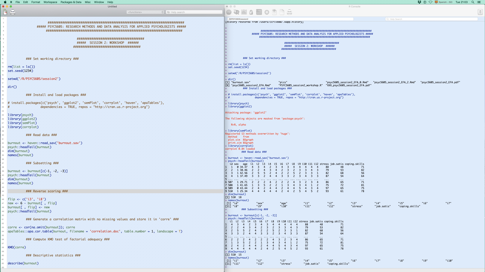
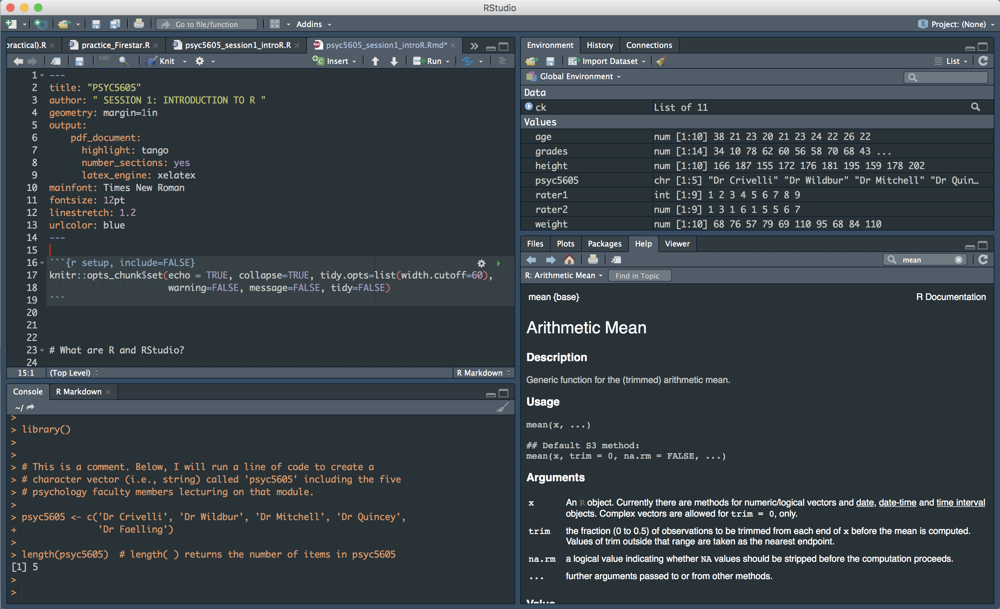

# Introduction to R


```{r setup2, include=FALSE}
knitr::opts_chunk$set(echo = TRUE, collapse=TRUE, tidy.opts=list(width.cutoff=60),
                      warning=FALSE, message=FALSE, tidy=F)
```


<div style="margin-bottom:40px;">
</div>

><left>**LEARNING OUTCOMES**</left>
><div style="margin-bottom:30px;">
></div>
>- Identify the capabilities of R and RStudio's environment and appraise their functionality.
>- Distinguish between R functions, objects, and diverse data wrangling approaches.
>- Apply basic programming skills to import and organize the data using classic data wrangling approaches and the **tidyverse** grammar.
>- Evaluate the R code and appraise the outputs to demonstrate a satisfactory level of basic programming skills in R.


<div style="margin-bottom:60px;">
</div>


**R** is a programming language and an open-source software environment for statistical computing and graphics available for Windows, MacOS, and Linux operating systems (R Core Team, 2023). R is an interactive environment for data science that enables us to import, manipulate, model, and visualize data to effectively communicate our results (Wickham & Grolemund, 2017). The use of R also promotes transparency and open research, with a clear focus on supporting reproducibility policies (Gandrud, 2015).

R, in its most basic form, is composed by (1) a *script* in which we write the lines of R code that we run, and (2) the *console* that displays the results and debugging (Figure 2.1). If we generate a plot, it will emerge as a pop-up window, showing one plot at a time. For more details on what is R, click [here](http://www.r-project.org){target="_blank"}.

<div style="margin-bottom:30px;">
</div>


```{r, Rpanels, fig.align = 'center', fig.cap = "R displayed in two panels: Script (left) and Console (right).", echo = FALSE, out.width = '100%'}

```


<div style="margin-bottom:40px;">
</div>

<div class="alert alert-success" role="alert">
  <h4 class="alert-heading" style="text-align: center; color: DarkRed">**Why Use R?**</h4>
  <ul><ul type = 'square' style="color: Black">
<li>It is a free and open-access programming environment for data science</li>
<li>Reproducible and transparent research in psychological science</li>
<li>Unlimited capabilities for data science (e.g., analysis, modelling, visualization)</li>
<li>It is dynamic. R is constantly evolving. It provides state-of-the-art solutions for any imaginable field (e.g., economics, psychology, genetics, medicine, ecology, sociology, computational physics, geography, psychometrics)</li>
<li>R has the biggest global community providing all sorts of free resources to support learners (e.g., [reference manuals](https://cran.r-project.org/doc/manuals/r-release/R-intro.html){target="_blank"}, [books](https://bookdown.org){target="_blank"}, [on-line tutorials](http://milton-the-cat.rocks/learnr/r/r_getting_started/#section-installing-r-and-rstudio){target="_blank"}, [R code and notebooks](https://debruine.github.io/lmem_sim/){target="_blank"}, [cheat sheets](https://github.com/rstudio/cheatsheets/blob/main/base-r.pdf){target="_blank"}, [Internet forums](https://community.rstudio.com){target="_blank"})</li>
<li>R is more efficient than any other commercial software</li>
<li>UK universities teaching 21st century data science with R: [University of Glasgow](https://psyteachr.github.io){target="_blank"}, Lancaster University, [Nottingham Trent University](https://www.ntu.ac.uk/about-us/events/events/2022/6/teaching-statistics-with-r-in-psychology){target="_blank"}, [University of Edinburgh](https://bookdown.org/animestina/dapr1_labs/){target="_blank"}, University of Lincoln, University of Manchester, University of Plymouth, University of Sussex, Queen Mary University of London, University of Sheffield, University of Essex, Oxford University, King's College, University of Warwick...</li>
<li>Employability</li>
  <ul></ul>
</div>


<div style="margin-bottom:60px;">
</div>


## What is RStudio?

**RStudio** is an Integrated Development Environment (IDE) for R. RStudio facilitates the task of coding by providing an enhanced programming experience. First, RStudio is free and easy to learn. Second, RStudio's elements are displayed in a four-panel display: the *code editor* (the script), the *console* (the results and debugging), the *global environment* (e.g., R objects, history of our session), and a *notebook* that includes different active tabs (e.g., plots, packages, help) (Figure 2.2). Last, there is an optimal integration of the different panels and tabs to run R sessions and projects smoothly.


<div style="margin-bottom:30px;">
</div>
  

```{r, RStudio, fig.align = 'center', fig.cap = "RStudio's four-panel display.", echo = FALSE, out.width = '100%'}

```


<div style="margin-bottom:40px;">
</div>

<div class="alert alert-success" role="alert">
  <h4 class="alert-heading" style="text-align: center; color: DarkRed">**Why Use RStudio?**</h4>
  <ul><ul type = 'square' style="color: Black">
<li>RStudio's main components are integrated into a four-pane layout: the *code editor* (the script), the *console* (the results and debugging), the *global environment* (the R objects, history of our session), and a *notebook*  to hold tabs for the files/plots/packages/help/viewer</li>
<li>The code editor is feature-rich and integrated with the built-in console</li>
<li>The code editor and console are efficiently linked to the files/plots/packages/help/viewer panels</li>
<li>RStudio is available for Windows, MacOS, and Linux</li>
<li>RStudio is easy to learn</li>
<li>For more details on what is RStudio, click [here](https://posit.co/products/open-source/rstudio/){target="_blank"}</li>
  <ul></ul>
</div>


<div style="margin-bottom:60px;">
</div>


## Let's get started!

In the first place, **R** and **RStudio** should be installed in your machine. To learn how to install **R** and **RStudio** in your computer, please read carefully Appendix \@ref(appenA1). 


### Running a line of code

There are several ways to run a line of code:

  - Highlight the line of code and click on the button **Run** ($\Rightarrow$ `Run`) displayed on the upper right side of the *code editor*.
  
  - Highlight the line of code that you want to run and press **Ctrl + Enter** (Windows) or **Cmd + Enter** (MacOS).
  
  - Place the cursor on the line of code and click on the button **Run** ($\Rightarrow$ `Run`).
  
  - Press **Ctrl + Shift + S** (Windows) or **Cmd + Shift + S** (MacOS) to run the code of an entire script.
  
  - Type a line of code directly into the *console* or copy a line of code from the *code editor* and paste it into the *console* after the prompt (`>`). Then, press **Enter** on the *console*.


### Adding comments on R scripts

It is useful to add comments before chunks of R code to organize the session and to inform others that might be interested in reproducing our session and evaluating our outputs. The hash mark (`#`) is used to make comments by placing the symbol at the beginning of a line of code. R won't execute the line of code that is preceded by one or more hash mark symbols.

```{r, comments}

# This is a comment
# Raise 5 to the power of 2

5 ^ 2

sqrt(25)  # sqrt(x) returns the square root of x

```


### Getting help

All R functions are included in packages that are created and maintained by their authors (e.g., statisticians, psychologists, biologists, sociologists). R packages are freely available on the Internet at the [*Comprehensive R Archive Network*](https://cran.r-project.org/web/packages/){target='_blank'} or CRAN. Every package has its own documentation that describes and explains how to use the functions of each package. We can also access to cheat sheets, on-line learning tools, forums and on-line communities, blogs, or even open-access books created in R using [**bookdown**](https://bookdown.org/yihui/bookdown/){target='_blank'} (Xie, 2017; Xie, Allaire, & Grolemund, 2019).


RStudio includes the documentation of functions and packages in the *Help* tab. For example, if we search for the function `mean()`, we will find the documentation for this function included in R's package **base**. Another way to access to the documentation of packages and functions when help is required is to use the function `help()` or the question mark (`?`) followed by the name of the function.

```{r, help_2}

help(mean)
?mean

```


## Starting a session in RStudio


### Setting the global options

It is possible to customize RStudio (e.g., code, appearance, organization of panels) to adapt it to our needs and preferences. To do so, click on the main **RStudio menu bar** $\rightarrow$ **Tools** $\rightarrow$ **Global Options**. Although there are many available options to customize RStudio sessions, we will mention below some of the most interesting features to inspect in the *global options* settings:

  - **General**: It is convenient to start a new R session to avoid carrying over variable corruptions. Consequently, do not restore or save .RData files into the workspace at startup. 
  
  - **Code-Display options**: To enhance the usability experience, enable *soft-wrap R source files*, *highlight selected word*, *show line numbers*, and *blinking cursor*. In the option *show margin*, set the margin column to 60.
  
  - **Appearance**: The customization of the *editor* and *console*'s appearance (e.g., font size) is pivotal as we will spend a lot of time looking at the computer screen when programming. For example, the use of dark background colors (e.g., material, chrome) is very popular among programmers because it minimizes eye strain or fatigue. If you are a low vision user, the high contrast generated by a dark background and white text will be beneficial as well.
  
  - **Pane Layout**: It is possible to reorganize the location of the panels. Likewise, it is possible to show or hide the different tabs available in the *global environment* and *notebook*. For instance, we could arrange the *source* on the upper left-hand side, inspecting the output of the code that we run underneath or on the right hand side (the *console* would be located on the bottom left corner or on the upper right corner respectively).
  

### First lines of code

Every session will start with three lines of code that we will include at the beginning of our R script. First, we will use the function `rm()` (i.e., remove) to delete any R object stored in the *global environment*. We want to start each session anew, without carrying over R objects from previous sessions. Second, we will set the randomization seed with the function `set.seed()` to reproduce the R objects and outputs of any simulated data and computation. Last, we will turn off the scientific notation used in R.


```{r, start_1, results='hide', eval = FALSE}

rm(list = ls())
set.seed(1234)  
options(scipen=999)

``` 


### Setting the working directory

There is a point-and-click approach to set the working directory for each R session. To do so, click on the main **RStudio menu bar** $\rightarrow$ **Session** $\rightarrow$ **Set Working Directory** $\rightarrow$ **Choose Directory**. Then, select the desired folder to store all the files of the session (e.g., the R file with the code, data sets).

When exporting plots and files, these files will be saved and stored locally in the working directory already set at the beginning of the session. For example, we created a folder called *R* located in the main SSD MacOS/C: hard drive that includes the directories of all our R projects. At a lower level, we created another folder called *psyc3012* (Data Science with R) to store the current R project that, in turn, includes one folder per session (e.g., *session1*, *session2*, *session3*).


<div style="margin-bottom:40px;">
</div>


<div class="alert alert-info hints-alert">
  <div class="hints-icon"><i class="fa fa-info-circle fa-2x fa-pull-right fa-border" aria-hidden="true"></i></div>
  <h4 class="alert-heading">**Setting the path for the working directory**</h4>
<ul><ul type = 'square' style="color: Black">
<li>The path should be short</li>
<li>Create a folder called *R* in your PC (C:) or MacOS (HD/SSD) hard drives. Then, create folders for different projects in the *R* folder</li>
<li>Use short names with no spaces (e.g., do not use a folder name such as *session  1*, but *session1* or *session_1*)</li>
<li>R is case sensitive (*psyc3012* differs from *PSYC3012*)</li>
<li>Use single ('*x*') or double quotes ("*x*") because the path is a character string</li>
  <ul></ul>
</div>


<div style="margin-bottom:60px;">
</div>


The function `getwd()` finds the path to the folder of our current working directory, whereas the function `setwd()` sets the working directory's path.


```{r, getwd_1, results='hide', eval = FALSE}

getwd()
setwd('~/R/psyc3012/session1')

```  


<div style="margin-bottom:40px;">
</div>


## R objects and functions

There are different kinds of entities that we identify as objects. Here, we will distinguish between R objects of different data structures (e.g., matrices, vectors, data frames, lists) and "recursive" objects such as those of mode *function* (Lander, 2017; Venables et al., 2009). We will refer to the latter as functions and to the former as R objects. In sum, we will use functions (e.g., `mean()`, `boxplot()`) to execute commands on R objects (e.g., atomic vectors, data frames, matrices).


### Functions

Let's imagine that we would like to command a robot to do something for us. We simply need to learn the robot's language (i.e., rules of grammar, syntax, vocabulary, code), so it can decode our commands and execute our orders. Any programming language will work in a similar way. For instance, we will need to read data from files (e.g., text file, CSV file, SPSS file) or to simulate our own data. These data should be appropriately stored and saved into R's *global environment* to be able to manipulate and organize our data (e.g., merge, subset, select, rename), to model and visualize the data, and to publish the results. To complete those tasks, we must use appropriate functions on data structures of the same mode.


#### The `c()` function

The `c()` function is usually referred as the concatenate or combine function. It combines two or more elements of the same mode (e.g., numerical values, character strings, logical values) to create vectors.


```{r, combine}

c(16, 71, 172, 53, 77)

c('Hylobates', 'Pongo', 'Gorilla', 'Pan', 'Homo')

c(FALSE, TRUE, TRUE, TRUE, TRUE)

```
  


### R objects


R objects such as character strings and numeric vectors, data frames, matrices or lists are saved and stored in R's *global environment* when we assign them to a name using the assignment operator (`name` $\gets$ `data`). The *console* shows the object only if it is recalled. To produce the assignment operator in Windows/Linux operating systems press **Alt** + **-**. Alternatively, press **Option** + **-** if using MacOS.

As a computing programming language, R executes our commands to produce certain outcomes. Sometimes those outcomes will appear on the *console* (e.g., estimating the arithmetic mean on a numerical vector). Other times, however, these commands won't produce effects on the *console*. For example, when we create a vector, it will only appear in the *global environment* tab unless it will be recalled in the same line of code preceded by a semicolon (`;`) or plaxed on a line of code below.

```{r, assignment_1}

weight <- c(16, 71, 172, 53, 77); weight

apes <- c('Hylobates', 'Pongo', 'Gorilla', 'Pan', 'Homo')
apes

```


If we don't assign a set of values to any given name to create an R object, these values won't be saved into the *global environment*. Therefore, we won't be able to recall the object for future computations.

```{r, assignment_2}

c(16, 71, 172, 53, 77)

```


Instead of creating an R object first, we could be tempted to paste a vector into a function. This approach is not efficient---specially with large data structures---and it should be avoided. Given the outstanding possibilities that R offers, we should create R objects and use functions on them to model and visualize the data.

```{r, assignment_3}

mean(c(16, 71, 172, 53, 77))

weight.apes <- c(16, 71, 172, 53, 77)

mean(weight.apes)
mean(weight.apes, trim = .20)
median(weight.apes)
sd(weight.apes)
length(weight.apes)

barplot(weight.apes, ylab = 'Weight (Kg)', xlab = 'Apes',
        col = 'coral3', ylim = c(0, 200),
        names.arg = c('Hylobates', 'Pongo', 'Gorilla', 'Pan', 'Homo'))

```


<div style="margin-bottom:40px;">
</div>


<div class="alert alert-info hints-alert">
  <div class="hints-icon"><i class="fa fa-info-circle fa-2x fa-pull-right fa-border" aria-hidden="true"></i></div>
  <h4 class="alert-heading">**Naming objects**</h4>
<ul><ul type = 'square' style="color: Black">
<li>R is case sensitive (e.g., the R object *weight* differs from *Weight*)</li>
<li>Do not start with a number or special characters (e.g., +, -, &, *, ?)</li>
<li>Using lower (e.g., *weight.apes*, *x*, *m2spr34*) rather than an upper case letters (e.g., *Weight.Apes*, *X*, *M2spr34*) facilitates the programming flow</li>
<li>Do not use names of functions to name R objects (e.g., `data()`, `mean()`, `plot()`, `factor()`)</li>
<li>When using several words, do not leave spaces. Alternatively, use the full stop, underscore, or a combination of UPPER and lower case letters (e.g., *g.spatial.males*, *g_fluid_females*, *gCrystallized*)</li>
<li>Use short, but informative names (e.g., *g.spatial.m*, *g_fluid_f*, *gCrystal*)</li>
  <ul></ul>
</div>


<div style="margin-bottom:60px;">
</div>


### Applying functions to objects
 
Functions work on data stored in R objects and saved in the *global environment*. We will place the name of the R object within the parentheses of functions, executing the command of the function on R objects. Below, we will compute the arithmetic mean (*M* = 52.1) and estimate the length (*N* = 10) of one numeric vector named *age*.
  
```{r, functions_example1}

age <- c(37, 19, 74, 62, 51, 56, 58, 76, 45, 43)
mean(age)
length(age)

```


Functions usually include arguments that allow us to modify their default settings. For example, the function `mean()` computes the arithmetic mean on the R object placed within parentheses. In the previous example, some outliers (e.g., 19, 76) might be distorting the estimation of the *age* distribution's central tendency. Luckily, the argument `trim` can be set from 0 (no trimming) to 0.5 (maximum trimming) to compute robust estimators of central tendency. By trimming 20% of the observations from each tail of the distribution (`trim = .20`), we will compute 20% trimmed means---a robust estimator of central tendency (Wilcox, 2016). The maximum trimming (`trim = .50`) computes the median as it only considers the central value of the distribution.
  
```{r, functions_example2}

mean(age, trim = 0)
mean(age, trim = .20)
mean(age, trim = .50)
median(age)

```


### Getting help

All R functions are included in packages that are created and maintained by their authors (e.g., statisticians, psychologists, biologists, sociologists). R packages are freely available on the Internet at the [*Comprehensive R Archive Network*](https://cran.r-project.org/web/packages/){target='_blank'} or CRAN. Every package has its own documentation that describes and explains how to use the functions of each package. We can also access to cheat sheets, on-line learning tools, forums and on-line communities, blogs, or even open-access books created in R using [**bookdown**](https://bookdown.org/yihui/bookdown/){target='_blank'} (Xie, 2017; Xie, Allaire, & Grolemund, 2019).


RStudio includes the documentation of functions and packages in the *Help* tab. For example, if we search for the function `mean()`, we will find the documentation for this function included in R's package **base**. Another way to access to the documentation of packages and functions when help is required is to use the function `help()` or the question mark (`?`) followed by the name of the function.

```{r, help_1}

help(mean)
?mean

```


## Packages

A package is a collection of functions, data sets, and compiled R code for a given purpose (e.g., visualize data, perform specific data analytical techniques). First, we must install the packages on our computer. These packages will be downloaded and stored locally just once. Then, we will upload these packages into our R session when required. The function `.libPaths()` shows the directory in which our packages are installed.

```{r, libPaths(), results='hide', eval = FALSE}

.libPaths()

```


R comes with a standard set of packages (e.g., **base**, **stats**). However, most of the time we will use specific packages that include useful functions to organize, model, and visualize our data. The function `library()` is used to inspect the packages that we have previously installed on our computer.

```{r, library(), results='hide', eval = FALSE}

library()

```


Currently (1st May 2023), there are 19,486 different R packages available on CRAN's (i.e., [*the Comprehensive R Archive Network*](http://cran.r-project.org/web/views/){target='_blank'}) repository. These packages are grouped into 42 topics (e.g., psychometrics, graphics, genetics, social sciences, chemometrics and computational physics, econometrics, machine learning, finance, clinical trials, hydrology, medical image analysis, environmetrics, reproducible research).


Some packages' names are self-explanatory (e.g., [**sem**](https://cran.r-project.org/web/packages/sem/sem.pdf){target='_blank'} for Structural Equation Models, [**apaTables**](https://dstanley4.github.io/apaTables/articles/apaTables.html){target='_blank'} for generating APA formatted Tables, [**Kendall**](https://cran.r-project.org/web/packages/Kendall/Kendall.pdf){target='_blank'} for computing Kendall's nonparametric correlation tests), whereas other names include the abbreviation of specific tests, statistical techniques, or even research methodologies (e.g., [**WRS2**](https://cran.r-project.org/web/packages/WRS2/WRS2.pdf){target='_blank'} for Wilcoxon's robust statistics, [**lavaan**](https://lavaan.ugent.be){target='_blank'} for latent variable analysis, [**sna**](https://statnet.org){target='_blank'} for social network analysis).


To learn how to install R packages in your machine, please read carefully Appendix \@ref(appenA2). To inspect the list of R packages used on this book and that you will need to install to reproduce all the examples of the book, please read Appendix \@ref(appenA3).


### Loading R packages

Some basic packages (e.g., **base**, **stats**, **graphics**) are automatically uploaded when we start our session in R and RStudio. In contrast, most R packages will have to be uploaded at the beginning of our session in order to use them. The functions `library()` and `require()` load packages, using the name of the package as the first argument of the function. When the packages are successfully uploaded into our session, they are displayed with a ticked box (i.e., active) in the *packages* tab.


```{r, library()_require(), results='hide', eval = FALSE}

library(magrittr)
require(dplyr)

```


## Importing and exporting data

The package [**rio**](https://github.com/leeper/rio){target='_blank'} enables us to import and export data sets from and into different formats (e.g., text, CSV, Excel, SPSS files). Traditionally, R users relied on functions such as `read.table()`, `read.csv()`, `read_excel()`, or `read_sav()` to import text files, csv comma-separated files, Excel files, or SPSS files. Similarly, the functions `write.table()`, `write.csv()`, `write_xlsx()`, and `write_sav()` were used to export data sets created and stored in the R session into an array of different formats. Unfortunately, to use most of these functions, R packages such as [**haven**](https://haven.tidyverse.org){target='_blank'}, [**readxl**](https://readxl.tidyverse.org){target='_blank'}, or [**writexl**](https://docs.ropensci.org/writexl/){target='_blank'} were required.

Luckily, the package **rio** operates like a Swiss-army knife, allowing us to easily import and export data via generic functions whose arguments specify the type of file, the path, the name, etc.


### Loading data

For example, we could read built-in data from the data sets loaded in our session using the function `data()`. From all the files available, we will read the data set `women` which includes the *height* and *weight* of 15 women.


```{r, data()}

data()
data(women)
women

```


Now, we will use the generic function `import()` from the package **rio** to read the `burnout` data set. The function `head()` shows the first six observations/participants of the R object included as the first argument of the function. In the following example, we are modifying the default settings that show the data of the first six observations/participants. We will request the first eight observations of the R object `burnout`.

```{r, import}

my.burnout <- rio::import('./datasets/burnout.sav')
head(my.burnout, 8)

```


<div style="margin-bottom:40px;">
</div>


<div class="alert alert-danger hints-alert">
  <div class="hints-icon"><i class="fa fa-exclamation-triangle fa-2x fa-pull-right fa-border" aria-hidden="true"></i></div>
  <h4 class="alert-heading">**CAUTION!**</h4>
<p style="color: Black">The data set that we want to import should be stored in the same folder of our working directory. If it is located in a different folder, the path should be specified in the code. For example, if the data set is in a folder named `data` inside of our working directory, the code should be as follows:</p>

    my.burnout <- rio::import('./data/burnout.sav')
</div>


<div style="margin-bottom:60px;">
</div>


IBM SPSS stores data frames into `.sav` files. Consequently, the file extension of the data set that we want to import needs to be explicitly included in the name of the file. To read CSV comma-delimited files, we will have to include the extension `.csv`. For Microsoft Excel files (i.e., spreadsheets) storing arrays of data sets using different sheets, we will use the file extension `.xlsx`.


<div style="margin-bottom:40px;">
</div>


<div class="alert alert-info hints-alert">
  <div class="hints-icon"><i class="fa fa-info-circle fa-2x fa-pull-right fa-border" aria-hidden="true"></i></div>
  <h4 class="alert-heading">**Using two colons (::) to load specific functions**</h4>
<p style="color: Black">We can use functions from packages that we have not previously loaded by adding the name of the package followed by two colons before the specific function we intend to use [e.g., `rio::import()`, `psych::desbribeBy()`].</p>
</div>


<div style="margin-bottom:60px;">
</div>


### Exporting data

To export data from our R session, enter the R object (e.g., a data frame) as the first argument and the appropriate file extension as the second argument (e.g., `format = 'txt'`). Below, we will export the data set called `my.burnout` as an Excel file (i.e., `format = 'xlsx'`).

```{r, export, eval = F}

rio::export(my.burnout, format = 'xlsx')

```


<div style="margin-bottom:50px;">
</div>


\newpage

## References

<div style="margin-bottom:20px;">
</div>


Gandrud, C. (2015). [*Reproducible Research with R and RStudio*](https://prism.librarymanagementcloud.co.uk/dmu/items/1039503){target='_blank'} (2nd ed.). Chapman and Hall/CRC.

Lander, J. P. (2017). [*R for everyone*](https://prism.librarymanagementcloud.co.uk/dmu/items/1039492){target='_blank'} (2nd ed.). Addison-Wesley.

R Core Team (2023). [*R: A language and environment for statistical computing*.](https://www.r-project.org){target='_blank'} R Foundation for Statistical Computing.

Venables, W. N., Smith, D. M., & the R Development Core Team. (2009). [*An Introduction to R*.](https://cran.r-project.org/doc/manuals/r-release/R-intro.pdf){target='_blank'} Network Theory Limited.

Wickham, H., & Grolemund, G. (2017). [*R for data science: Import, tidy, transform, visualize, and model data*.](http://r4ds.had.co.nz){target='_blank'} O'Reilly.

Wickham, H., Averick, M., Bryan, J., Chang, W., McGowan, L. D., François, R., Grolemund, G., Hayes, A., Henry, L., Hester, J., Kuhn, M., Pedersen, T. L., Miller, E., Bache, S. M., Müller, K., Ooms, J., Robinson, D., Seidel, D. P., Spinu, V., Takahashi, K., Vaughan, D., Wilke, C., Woo, K., & Yutani, H. (2019). Welcome to the Tidyverse. *Journal of Open Source Software*, *4*(43), 1686. Retrieved at [https://joss.theoj.org/papers/10.21105/joss.01686](https://joss.theoj.org/papers/10.21105/joss.01686){target='_blank'}

Wickham, H., François, R., Henry, L., & Müller, K. (2022). *dplyr: A grammar of data manipulation*. Retrieved at [https://dplyr.tidyverse.org](https://dplyr.tidyverse.org){target='_blank'}

Xie, Y. (2015). [*Dynamic documents with R and knitr*](https://prism.librarymanagementcloud.co.uk/dmu/items/1039504){target='_blank'} (2nd ed.). Chapman and Hall/CRC.

Xie, Y., Allaire, J. J., & Grolemund, G. (2019). [*R Markdown: The definite guide*.](http://bookdown.org/yihui/rmarkdown/){target='_blank'} Chapman and Hall/CRC.


<div style="margin-bottom:50px;">
</div>


