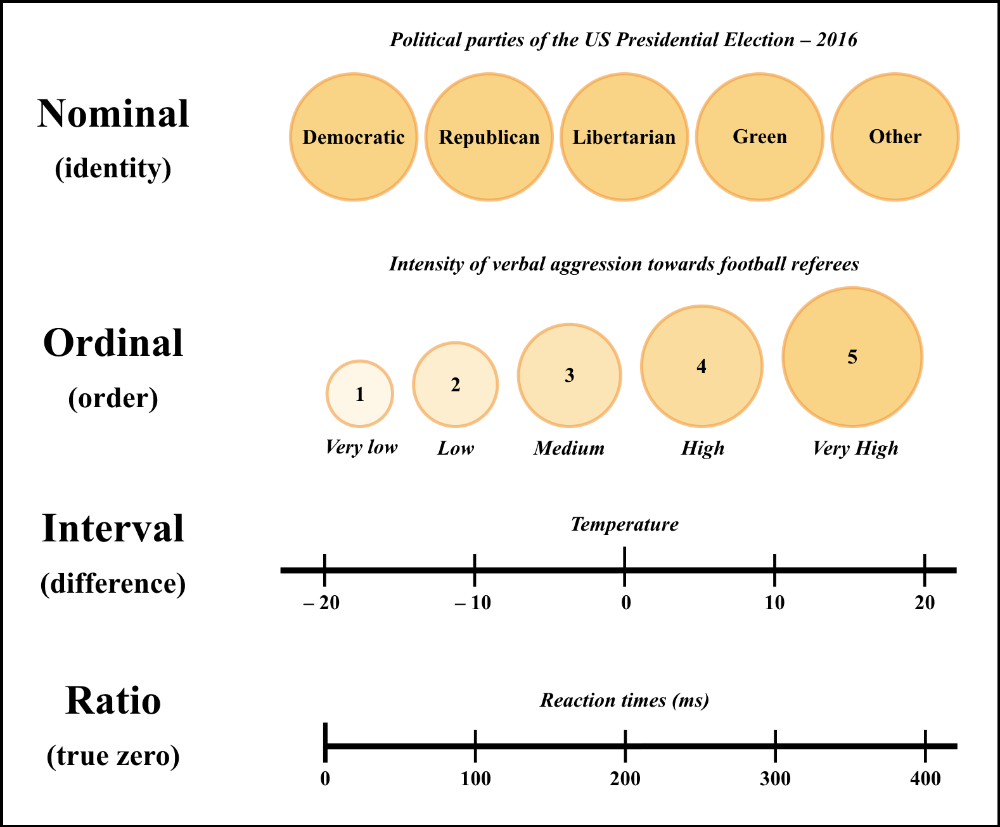

# (PART) Psychometrics {-} 

# Scale Development


```{r setup12, include=FALSE}
knitr::opts_chunk$set(echo = TRUE, collapse=TRUE, tidy.opts=list(width.cutoff=60),
                      warning=FALSE, message=FALSE, tidy=F)
```


<div style="margin-bottom:40px;">
</div>


><center><h1 style="font-size:160%; color: #000000">**LEARNING OUTCOMES**</h1></center>
><div style="margin-bottom:30px;">
></div>
>-  Define measurement and give several examples of measurement in psychology.
>-  Explain what is a psychological construct and give several examples.
>-  Distinguish the four levels of measurement, give examples of each level,
and explain why this distinction is important.
>-  Identify the different classification systems of psychological tests
and critically evaluate their implications for scale construction.
>-  Name the stages and evaluate the iterative process of scale development.


<div style="margin-bottom:70px;">
</div>


**Psychometrics** is the science of psychological assessment. It is a subfield of methodology that studies the process of measuring psychological and social phenomena using formal mathematical models.

What do psychologists measure? Do psychologists measure physical objects or hypothetical entities? Although many classic psychological studies have measured overt behaviors (e.g., reaction time, occurrence of a behavioral repertoire), the measurement of behavior has decreased exponentially after the cognitive revolution. Nowadays, psychologists usually ask respondents to complete questionnaires, inventories, and scales by clicking on a computer screen or by ticking a box in paper-and-pencil psychological tests.

Psychologists tend to measure unobservable variables that are operationalized in various ways. Thus, a **psychological construct** (i.e., a latent variable) is a theoretical psychological entity that cannot be measured directly. To measure latent variables, we need to develop instruments that will include items or tasks devised to measure the underlying psychological construct. Consequently, the **observed variables** (i.e., measures) are assumed to be probabilistic functions of underlying unobservable variables (i.e., latent variables).


<div style="margin-bottom:40px;">
</div>


<div class="alert alert-info hints-alert">
  <div class="hints-icon"><i class="fa fa-info-circle fa-2x fa-pull-right fa-border" aria-hidden="true"></i></div>
  <h4 class="alert-heading">**Latent and observed variables**</h4>
<ul><ul type = 'square' style="color: Black">
<li>Guided by a theory, specify what do you want to measure. For example, if we are interested in measuring the psychological construct *extraversion*, we need to define theoretically the limits of the construct before deciding how to measure it using observed variables</li>
<li>Make decisions on the purpose of the test and on how you will assign numbers (i.e., scaling) to the observed variables. Should we construct categorical, ordinal, or interval scales? Should we use a knowledge-based or a person-based questionnaire? Should we use norm-referenced or criterion-referenced tests?</li>
<li>Generate a psychometric model of the data to estimate the latent variables. We can use data-reduction techniques (e.g., exploratory factor analysis) guided by theory. We also need to evaluate how reliable is our psychometric model</li>
<li>Model the structure of the latent variables to check whether our data fit the model (i.e., the theory) or not. We can also compare between different models to assess which one provides a better fit</li>
  <ul></ul>
</div>


<div style="margin-bottom:60px;">
</div>


How can we measure psychological constructs such as *intelligence*, *neuroticism*, *psychological well-being*, *students' satisfaction*, *academic performance*, *attitudes towards refugees and migrants*, or *depression*? We must transform observations into data and to apply formal mathematical models to assign numbers to subjects' attributes relying on their responses or on the stimuli observed. In sum, we need to assign numbers to observed psychological phenomena and to unobserved constructs, while assessing the fit of theoretical models to data.


## Reflective and formative indicators 

Psychologists mainly work with unobservable entities (e.g., *depression*, *impulsiveness*, *intelligence*), not with the items or scales (i.e., measures). The items of a given test are the indirect way to measure the underlying psychological construct (i.e., a latent variable). The domain covered by any psychological construct is sampled through items. Consequently, a scale (e.g., 9 items measuring *job burnout*) intends to *reflect* the underlying psychological construct (i.e., *job burnout*). Latent variables are regarded as causes of item scores. The magnitude (i.e., strength) of the latent variable is assumed to cause an item to take on a certain value. Sometimes, some subdomains emerge (i.e., factors). These subdomains or factors are identified using iterative conceptual and empirical analyses (e.g., exploratory factor analysis). In sum, observed measures (e.g., items) reflect the latent variable (Figure 12.1).


<div style="margin-bottom:30px;">
</div>


```{r, Fig1201Models, fig.align = 'center', fig.cap = "Reflective and formative indicator models.", echo = FALSE, out.width = '100%'}


library(DiagrammeR)
#webshot::install_phantomjs()
grViz("
digraph {
  style = 'filled, dashed'
  rankdir = TB  

  subgraph cluster_reflective {
   label='A. Reflective indicator model'
   labeljust = l
   fontsize = '13'
  fontname = 'Arial Bold'

    # several 'node' statements
  node [shape = oval,
        fontname = Arial,
        style = filled,
        penwidth = 1.5]
  A [label = 'Job Burnout',
    fontsize = 12,
    fillcolor = darksalmon]
  B [label = 'Unfairness',
    fontsize = 12,
    fillcolor = darksalmon]
  C [label = 'Lack of control',
    fontsize = 12,
    fillcolor = darksalmon]
  D [label = 'Reward',
    fontsize = 12,
    fillcolor = darksalmon]

  node [shape = square,
        width = 0.2,
        fillcolor = cornflowerblue,
        fontsize = 11]
  Y1; Y2; Y3; Y4; Y5; Y6; Y7; Y8; Y9

  # several 'edge' statements
  A->B A->C A->D
  B->Y1 B->Y2 B->Y3
  C->Y4 C->Y5 C->Y6
  D->Y7 D->Y8 D->Y9
  }

  subgraph cluster_formative {
    label='B. Formative indicator model'
    labeljust = l
    fontsize = '13'
    fontname = 'Arial Bold'

    node [shape = oval,
        fontname = Arial,
        style = filled,
        fillcolor = darksalmon,
        penwidth = 1.5]
  E [label = 'Socioeconomic status',
    fontsize = 12] 
   
    node [shape = square,
          fixedsize = true,
          width = 1.71,
          height = 0.5,
          fillcolor = cornflowerblue,
          fontsize = 12]
  Y10 [label = 'Income']
  Y11 [label = 'Education']
  Y12 [label = 'Occupational status']

  # several 'edge' statements
  E->Y10 [dir = back]
  E->Y11 [dir = back]
  E->Y12 [dir = back]

  }
  //A->E;

    edge[ style = invis ];
    { Y1; Y2; Y3; Y4; Y5; Y6; Y7; Y8; Y9 } -> E;
}
")

```


<div style="margin-bottom:40px;">
</div>


## Classification of scales of measurement


Psychologists have taken an *a priori* approach to scaling, avoiding the problems related to representation, uniqueness, invariance, and meaningfulness (Krantz et al., 1970). Although the properties of interval scales are often violated, we tend to assume that the values assigned to the responses given to psychological tests, questionnaires, or inventories form an interval scale. Let's review the popular classification of scales of measurement defined by Stevens (1946) (Figure 12.2).


<div style="margin-bottom:30px;">
</div>


```{r, Fig1202scaling, fig.align = 'center', fig.cap = "Classification of scales.", echo = FALSE, out.width = '90%'}

```


<div style="margin-bottom:40px;">
</div>


### Nominal scale

It consists of qualitative and unordered categories (e.g., political parties of the US Presidential Election-2016). The property of this type of scale is **identity** (i.e., *X* does/doesn't belong to the category *Y*). Nominal scales have two distinctive features:

  - Categories should be mutually exclusive.
  - Categories should be exhaustive.


### Ordinal scale

It orders people, subjects, events, or characteristics along some continuum (e.g., intensity of verbal aggression towards football referees). The property of this type of scale is **order** (i.e., *X* is more/less than *Y*). Ordinal scales have two distinctive features:

  - Numbers place objects in order.
  - No information is given about the differences between points of the scale.


### Interval scale

It is a scale on which equal intervals between objects represent equal differences (e.g., temperature). The property of this type of scale is **difference** (i.e., the difference between *X* and *Y* is the same as the difference between *A* and *B*). Interval scales have three distinctive features:

  - Differences are meaningful.
  - No information is given about ratios.
  - The value *zero* is arbitrary.
  

### Ratio scale

It is a scale that includes a true *zero* that corresponds to the absence of the characteristic being measured (e.g., reaction time). The property of this type of scale is **ratio** (i.e., *X* is twice as long as *Y*). Interval scales have one distinctive feature:

  - Ratios are meaningful.


## Test theory

Test theory is grounded on statistics and the theory of probability. It assumes that the values assigned to the observations (i.e., subjects' responses) constitute a scale. The final goal of test theory is to locate the subjects or the stimuli along a continuum of a non-observable attribute (i.e., a latent trait).

### What is a test?

A test is a device or procedure in which a sample of a respondent's behavior in a specified domain is obtained, evaluated, and scored using a standardized process (Standards for Educational and Psychological Tests, 2014). On the one hand, psychological tests include instruments measuring the correctness or quality of the responses (e.g., measures of ability, aptitude). On the other hand, tests are also used to measure attitudes, preferences, and predispositions (e.g., measures of personality, mental health, cognitive functioning, attitudes).


<div style="margin-bottom:40px;">
</div>

<div class="alert alert-danger hints-alert">
  <div class="hints-icon"><i class="fa fa-exclamation-triangle fa-2x fa-pull-right fa-border" aria-hidden="true"></i></div>
  <h4 class="alert-heading">**CAUTION!**</h4>
<ul><ul type = 'square' style="color: Black">
<li>There is no unique and universally accepted measure for any given construct. It is required to examine the theoretical framework and its specifications</li>
<li>All tests are based on limited samples of behavior extracted from the defined population of the domain</li>
<li>There is always a measurement error (sampling error)</li>
<li>Absence of scales with origin and unit of measurement (i.e., indetermination of the measurement scale)</li>
<li>Latent variables cannot be defined in isolation, but by establishing its nomological network with other constructs and observed variables</li>
  <ul></ul>
</div>


<div style="margin-bottom:60px;">
</div>


### Classification of psychological tests

  - **Type of domain**: Tests are usually classified as cognitive (e.g., intelligence, ability, academic performance) and non-cognitive tests (e.g., personality, attitudes, motivations, mood). Other authors refer to these two groups of tests as *ability* (measures of maximum performance) versus *personality* (measures of typical performance) tests.

  - **Consequences for the subject**: Tests can be placed into a continuum ranging from *high-* to *low-stakes*. If the test's scores are used to determine an important outcome (e.g., to get a job, A levels, clinical screening), then it is a high-stakes test.

  - **Response format/task**: The most common response formats range from a *selected-response* (i.e., the respondent selects the correct, best, or most appropriate response from a list of possible answers to questions or stimuli) to a *constructed-response item format* (i.e., the respondent produces a written response to a question or stimulus).

  - **Administration**: Tests can be classified according to the administration mode. For example, a psychological test can be administered individually versus collectively, paper-and-pencil versus on-line tests, or adaptive versus non-adaptive tests.

  - **Response-time constraints**: Some psychological tests are classified as *speed tests* when the items are rather easy but include a time limit. On the other hand, tests classified as *power tests* are designed to measure the ability of the respondent, not the speed when performing these tests.

  - **Statistical model**: Tests can be classified in relation to the statistical model in which the test scores are based. *Classical Test Theory* (CTT) is based on the general linear model and test total scores. *Item Response Theory* (IRT) is based on a nonlinear model estimating the probability to answer to a given item as a function of the different levels of the underlying trait or ability.

  - **Interpretation of the scores**: Some tests focus on the degree of coverage of a certain domain or a predetermined criterion (i.e., *criterion-referenced tests*). Other tests, however, focus on the relative position of the respondent in relation to a reference group (i.e., *norm-referenced tests*).


### Measurement error

In applied statistics and psychometrics we model data. Models are representations of reality and they do not often fit well into our data. Even in disciplines such as physics, some randomness is expected. Measurement error is pervasive and we need to include it when we model our data. Thus, our data result from adding to the model some measurement error (it is often called *residual*).


<div style="margin-bottom:30px;">
</div>


$$\begin{aligned}
Data = Model \ + \ Residual\\
\end{aligned}$$

<div style="margin-bottom:40px;">
</div>


In turn, the measurement error will result from subtracting our model to our data. Put differently, the model is what we know (e.g., the theory X that we used to explain *job burnout*) and the residual or error is what we still do not know (e.g., what remains unexplained by theory X in relation to the phenomenon of *job burnout*).


<div style="margin-bottom:30px;">
</div>


$$\begin{aligned}
Residual = Data \ - \ Model\\
\end{aligned}$$

<div style="margin-bottom:40px;">
</div>


In psychometrics, we assume that any observed score ($X_{i}$) is the result of a true score ($T_{i}$) plus its measurement error ($E_{i}$). Thus, the true score is the quantity that one subject has for a given trait, ability, or attribute. The observed score and the measurement error are random variables, whereas the true score is assumed to be a constant (the score obtained after infinite number of observations on the same subject).


<div style="margin-bottom:30px;">
</div>


$$\begin{aligned}
X_{i} = T_{i} \ + \ E_{i}\\
\end{aligned}$$

<div style="margin-bottom:40px;">
</div>


There are **two sources of error**: *random error* (unsystematic error) and *bias* (systematic error) (Figure 12.3). In turn, random error decomposes into generic random error and idiosyncratic random error, whereas bias decomposes into additive systematic error and correlational systematic error (Viswanathan, 2005).

<div style="margin-bottom:30px;">
</div>


```{r, Fig1203errorBias, fig.align = 'center', fig.cap = "Random error (unsystematic error) and bias (systematic error).", echo = FALSE, out.width = '100%'}

set.seed(1234)

xseq <- seq(-4, 4, 0.01)
density1x <- dnorm(xseq, 0, 0.8)
density2x <- dnorm(xseq, 0, 1.3)

yseq <- seq(-4, 4, 0.01)
density1y <- dnorm(yseq, 0, 0.8)
density2y <- dnorm(yseq, 1.7, 0.8)


opar <- par(no.readonly = TRUE)

par(mar = c(4.5, 4.5, 3, 1))

par(mfrow=c(2, 1))

plot(xseq, density1x, col = "blue",
     xlab = "X", ylab = "Probability",
     cex.lab = 1, cex.main = 1.1, type = "l", lwd = 2.5,
     cex = 1.1, main = "Random Error",
     cex.axis = .7)
lines(xseq, density2x, col = "red", type = "l", lwd = 2.5,
      cex = 1.5, cex.axis = .8)
abline(v = 0, col = 'black', lty = 2, lwd = 1.8)


plot(yseq, density1y, col="blue",
     xlab = "X", ylab = "Probability",
     cex.lab = 1, cex.main = 1.1, type = "l", lwd = 2.5,
     cex = 1.1, main = "Bias",
     cex.axis = .7)
lines(yseq, density2y, col = "red",
		type = "l", lwd = 2.5, cex = 1.5, cex.axis = .8)
abline(v = 0, col = 'blue', lty = 2, lwd = 1.8)
abline(v = 1.7, col = 'red', lty = 2, lwd = 1.8)

par(opar)

```


<div style="margin-bottom:40px;">
</div>


#### Random error

It is any type of error that is inconsistent, or it does not repeat in the same magnitude or direction except by chance. This variability in data collection tends to be averaged out in the long run. Sources of random error could be related to ambiguity, unclear wording, or double-barreled questions.

  - **Idiosyncratic random error**: It affects a few subjects (e.g., mood, language comprehension).
  - **Generic random error**: It affects many subjects (e.g., item-wording effects, noisy setting).


#### Bias

It is a type of error that consistently affects our measurements. After taking many repeated measures, this systematic error biases the measurement positively or negatively. Luckily, we can predict this type of error. For example, between the first and the second administration of a test, maturation, learning, or fatigue might explain the bias.

  - **Additive systematic error**: It increases or decreases the observed values by a constant magnitude (e.g., leading questions).
  - **Correlational systematic error**: It increases or decreases the relationship between variables (e.g., some subjects might interpret the response categories in some way, whereas other subjects might interpret these categories in a different way).


## Scale development

A valid, reliable, and rigorous psychological instrument needs to comply with some standards that will support its quality. These standards for scale development (Standards for Educational and Psychological Tests, 2014) are published and updated regularly by the *American Educational Research Association* (AERA), the *American Psychological Association* (APA), and the *National Council on Measurement in Education* (NCME). 

As shown in Table 12.1, the construction of a test is an iterative process aimed at improving the psychometric principles of reliability, validity, comparability, and fairness. These 12 stages of scale development could be grouped into seven main tasks to be completed by the research team:

<div style="padding-left: 40px;">

1. To clearly identify the purpose of the test (e.g., clinical screening) as well as any administration restrictions (e.g., time, administration mode).
2. To define the domain and, based on the domain, create the test specification (i.e., blueprint).
3. To generate an initial pool of items that should be reviewed by a group of experts before beginning the pilot stage.
4. To pre-test the reviewed pool of items using a small sample of respondents to evaluate the psychometric principles of the initial test.
5. To modify the test to achieve higher quality standards after evaluating its psychometric properties.
6. To field test the modified scale using a larger and normative sample (e.g., respondents with a Major Depressive Disorder diagnosis to develop an instrument aimed at this population) to set the final form of the test.
7. To develop guidelines for the administration of the test, the scoring system, and the interpretation of the scores.


<div style="margin-bottom:30px;">
</div>


```{r, Table1201a, eval = TRUE, include = F, echo = F}

library(dplyr)
library(kableExtra)

```


```{r, Table1201b, eval = TRUE, include = T, echo = F}

library(kableExtra)
library(dplyr)
knitr::kable(data.frame
             (Stage = c(1:11),
              Description = c('Purpose identification',
                              'Administration restrictions',
                              'Defining the domain',
                              'Test specification (blueprint)',
                              'Construct an initial pool of items',
                              'Review the items', 'Pilot the initial test',
                              'Modification of test', 'Field test',
                              'Review the items (final form of test)',
    'Develop guidelines for administration, scoring, and interpretation of scores')),
             format = 'html', booktabs = T, align = 'l',
             escape = F, linesep = '',
             caption = 'Stages of Scale Development') %>%
  kable_styling(font_size = 14, bootstrap_options = c('striped',
                                                  'responsive')) %>%
  row_spec(0, hline_after = T, background = '#E1FAFF') %>%
  footnote(general_title = '**Note.**',
           general = 'Between Stages 7 and 8, the researcher will analyze the initial pool of items guided by the four psychometric principles to ensure that the scale is reliable, valid, comparable, and fair. Using an iterative approach, the initial pool of items will be sequentially modified until the final form of the scale will be established.',
           footnote_as_chunk = TRUE,
           escape = F)

```


<div style="margin-bottom:40px;">
</div>


### Purpose of the test

We must clarify and specify the purpose of the test, the psychological construct that we would like to measure, and what type of decisions will be derived from the test scores. On the one hand, these scores might be used to decide whether one respondent has enough abilities, skills or knowledge on a certain topic or domain (e.g., criterion-referenced tests). On the other hand, test scores might be used to compare subjects of a normative sample for recruitment, psychological assessment, ranking and promotion, classification of people and roles or even clinical screening.


### Administration restrictions

These restrictions are related to time limit (speed versus power tests), the administration mode (e.g., individually, collectively, computer adaptive testing) and the materials being used (e.g., calculator, lab materials, dictionaries, computers).


### Defining the domain

To define the domain, we need to think on the set of abilities, knowledge, or traits that we want to measure. These abilities and traits must be related to a specific domain of behaviors and situations that will elicit the latent variables being measured. These behaviors need to *reflect* the latent variable (i.e., the psychological construct).

Psychological constructs are based on theoretical frameworks. Consequently, an in-depth review of the relevant literature will reveal previous attempts to measure the same (or similar) psychological construct. A theory-driven process defining the limits of the psychological construct is recommended. Once the psychological construct has been set, the researcher must specify the behaviors that will reflect the psychological construct as well as the situations and tasks devised to elicit these behaviors.


### Test specification (blueprint)

To generate items or tasks to measure the behaviors identified when defining the domain, we need to specify all the content areas and the differential weighting of facets. For example, a *rubric* designed to assess psychology students' knowledge in a module of neuroanatomy and psychophysiology will include items or tasks devised to cover the module's key topics (e.g., brain structures' names and functions, cranial nerve nuclei connections, hormonal pathways). However, not all areas or facets being covered in the test have the same relevance. For this reason, most rubrics include facets with different weightings. For instance, writing a good title or abstract in a quantitative report cannot be considered of equal relevance as writing a good *results* section.


### Draft the initial pool of items, review them, and pilot them

The initial pool of items is usually built on the assumption that most of these items won't be included in the final test. It is important to have in mind the purpose of the test before selecting the appropriate response format (e.g., multiple choice, open ended, sorting, identification, correction, filling the gaps, building a response, a presentation).

If we decide to use a response format in which respondents have to select their answers from a group of options, then we need to decide how many options to include. For ability tests, the options could range from a *true* versus *false* format to several alternatives (ideally no more than 3 response options). In contrast, personality tests could be designed with dichotomous answers (*yes* versus *no*) or with graded responses (usually 4 to 9 different points in a quasi-interval scale). Popular graded scales include the pervasive Likert scale, the semantic differential, or the visual analog (Revelle, 2022).

Regarding the statements, situations, and behaviors that we evaluate in each item, some rules might apply. Clarity and brevity should always guide scale construction. We must avoid redundancy, ambiguity, and double-barreled items. We need to include some items with a negative wording. These items will require reversing when analyzing the psychometric properties of the scale.

The initial pool of items should be reviewed by a group of experts before being administered to a small sample of respondents. These experts will provide very valuable feedback on methodological and theoretical grounds. Once the initial pool of items will be pretested, we will have to conduct analyses to assess the psychometric properties of the items and the test. When piloting the initial pool of items, it is very important to gather qualitative data (e.g., interviews when debriefing the respondents) on instructions' comprehension, item wording and language ambiguity, time constraints, or the effect of respondents' performance.


### Psychometric principles: Reliability, validity, comparability, and fairness

The reviewed pool of items needs to be pretested on a small sample of respondents to conduct the first quality checks on the psychometric model: reliability, validity, comparability, and fairness.


#### Reliability

It accounts for the errors produced during the measurement process. To what extent the observed scores reflect the respondent's true score on the test? Thus, reliability might be related to the repetition and generalization of the measures, the internal consistency of test, or the level of agreement across raters.


#### Validity

To what extent the purpose of the test is justified by the nomological network? Are we really measuring what we assume that we are measuring? The psychological construct must be represented in a network of interrelated constructs. We need to examine the network of related psychological constructs and the theories that support the data to test how credible is our proposed model. For doing so, we will use different sources of evidence (e.g., predicted validity, content validity, convergent validity).


#### Comparability

Sometimes, different modes of test administration (computerized versus paper-and-pencil) or different experimenters leading the task could produce an unexpected impact on test scores. We need to rule out alternative explanations that could undermine the comparability of respondents' scores. Interestingly, *Generalizability Theory* (Brennan, 2001), an extension of Classical Test Theory, allows us to decompose the sources of error variance using facets (i.e., conditions of measurement): respondents, tasks, and raters.


#### Fairness

The concept of fairness is related to the assumption that the different subsamples being tested do not produce test scores that are biased by sociodemographic differences (e.g., education, gender), language comprehension, or even familiarity with the task.

Bias has become a major topic in psychometrics due to the impact of biased high-stakes scales on people's lives. Although there are different forms of bias (e.g., internal, external), item bias has been profusely discussed by psychometricians. There are different approximations to detect item bias (Rust & Golombok, 2009). For example, we can inspect and compare the level of difficulty of each item between two or more groups of respondents (e.g., males versus females). Another approach to item bias relies on comparing the factor analytical structure of different subsamples' scales.


### Field test and the development of guidelines for administration, scoring, and interpretation of test scores

After checking the psychometric principles of the initial test, an improved version of this test will be administered to a larger and normative sample. The field test will be key to generate the final form of the test. Once the final form of the test will be established, we will write the test guidelines.

These guidelines are written for test users interested in administering them in the future. Most of the potential users of the recently developed scale won't be psychometricians or experts in the psychological construct of interest. For this reason, the standards to develop and publish tests, questionnaires, and inventories need to be of a certain quality and clarity (Standards for Educational and Psychological Tests, 2014).

The guidelines will include the theoretical framework that supports the psychological construct's specification. Likewise, the guidelines will comprise the purposes of the test, the target population, instructions to administer the test, reliability coefficients and details on the accuracy of the measurement. We will also provide evidence of different types of validity (e.g., criterion validity, convergent validity, construct validity) for the given purposes of the test. Finally, we will provide suggestions on the potential applications of the test (e.g., clinical screening) and the norms to interpret test scores.


## References

<div style="margin-bottom:20px;">
</div>


American Educational Research Association, American Psychological Association, & National Council on Measurement in Education (2014). [*Standards for educational and psychological testing*.](https://www.testingstandards.net/uploads/7/6/6/4/76643089/standards_2014edition.pdf){target="_blank"} American Educational Research Association.

Brennan, R. L. (2001). *Generalizability Theory*. Springer Verlag.

Krantz, D. H., Luce, R. D., Suppes, P., & Tversky, A. (1971). *Foundations of measurement. Vol. 1*. Academic Press.

Revelle, W. (2022). *An introduction to psychometric theory with applications in R*. Springer. Retrieved at [http://www.personality-project.org/r/book/Chapter2.pdf](http://www.personality-project.org/r/book/Chapter2.pdf){target="_blank"}

Rust, J., & Golombok, S. (2009). *Modern psychometrics: The science of psychological assessment* (3rd ed.). Routledge.

Stevens, S. S. (1946). [On the theory of scales of measurement.](https://psychology.okstate.edu/faculty/jgrice/psyc3214/Stevens_FourScales_1946.pdf){target="_blank"} *Science*, *103*, 677—680.

Viswanathan, M. (2005). *Measurement error and research design*. SAGE.


<div style="margin-bottom:50px;">
</div>


