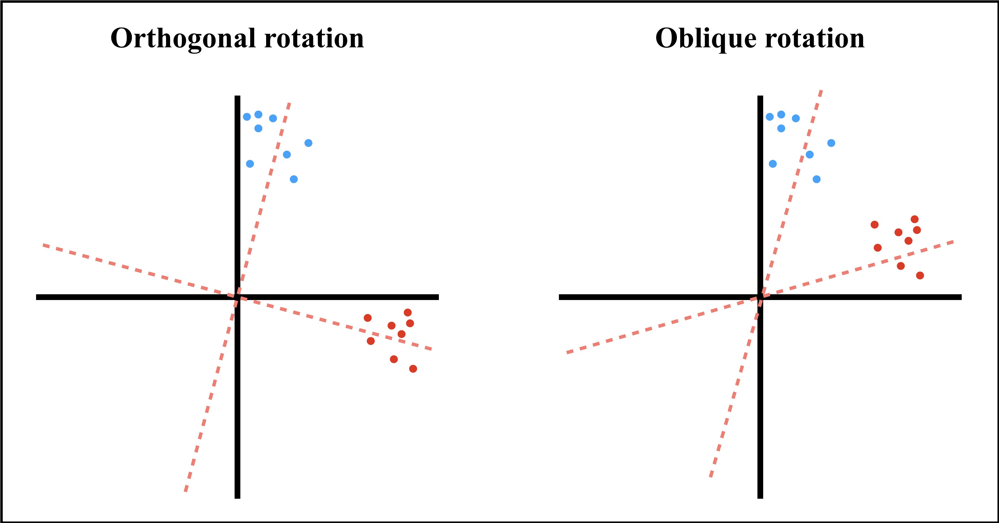

# Exploratory Factor Analysis


```{r setup13, include=FALSE}
knitr::opts_chunk$set(echo = TRUE, collapse=TRUE, tidy.opts=list(width.cutoff=60),
                      warning=FALSE, message=FALSE, tidy=F)
```


<div style="margin-bottom:40px;">
</div>


><center><h1 style="font-size:160%; color: #000000">**LEARNING OUTCOMES**</h1></center>
><div style="margin-bottom:30px;">
></div>
>-  Identify and compare the key features of formative and reflective models.
>-  Evaluate the differences between Exploratory Factor Analysis (EFA) and Confirmatory Factor Analysis (CFA).
>-  Apply R to tidy and organize the data set before estimating the scale's correlation matrix and generating data visualizations.
>-  Apply factor extraction and rotation techniques to generate the scale's simplest factorial structure.
>- Appraise the outputs of the EFA model, interpret the results, and generate plots showing the factorial structure of a scale.


<div style="margin-bottom:70px;">
</div>


**Multivariate statistics** are a set of statistical techniques aimed at analyzing data when we have many independent variables and/or many dependent variables correlated with one another to varying degrees (Tabachnick & Fidell, 2013). The variables included in our research design might be related via dependence or interdependence models (Hair et al., 2006).

**Dependence methods** attempt to predict the outcome (i.e., dependent variable) using one or several predictors (i.e., independent variables). Thus, some variables will be retained in the final model allowing us to explain, to a certain degree, the outcome. Dependence methods are usually classified as a function of the number of dependent variables being measured (i.e., one dependent variable versus two or more) and the nature of the measurement scales and predictors (i.e., nominal, ordinal, or quantitative data).

For instance, to estimate a predictive model when the outcome is one quantitative variable and the explanatory variables are quantitative as well, we use a multiple regression analysis technique (General Linear Model).


<div style="margin-bottom:30px;">
</div>

$$\begin{aligned}
Y = \beta_{0} \ + \beta_{1}X_{1} \ + \beta_{2}X_{2} \ + \beta_{3}X_{1}X_{2} + \epsilon \\
\end{aligned}$$

<div style="margin-bottom:40px;">
</div>


On the other hand, to estimate a predictive model when we have several quantitative outcomes (i.e., several dependent variables) and the explanatory variables are quantitative as well, we will use a Structural Equation Modeling (SEM) approach.


**Interdependence methods** are aimed at finding the underlying structure of a set of variables, cases, or objects that are analyzed simultaneously. As Table 13.1 shows, these multivariate techniques are usually classified by the nature of the correlated variables (variables, cases, or objects) and by the type of data that we use (quantitative versus categorical data).

<div style="margin-bottom:30px;">
</div>


```{r, Table1301a, eval = TRUE, include = F, echo = F}


Tab1301 <- data.frame(relation = c('Variables', '', '',
                        'Cases', 'Objects', ''),
           dat = c('Quantitative', '', '',
                   'Quantitative',
                   'Quantitative',
                   'Categorical'),
           stat.tech = c('Principal components',
                         'Factor analysis',
                         'Cluster analysis',
                         'Cluster analysis',
                         'Multidimensional scaling',
                         'Correspondence analysis'))
names(Tab1301) <- c('Relationships among', 'Data', 'Statistical technique')

```


```{r, Table1301b, eval = TRUE, include = T, echo = F, out.width = '100%', fig.align = 'center'}

library(kableExtra)
library(dplyr)
knitr::kable(Tab1301, format = 'html', booktabs = T,
             align = 'l', linesep = '', escape = F,
  caption = 'Classification of Multivariate Analyses Used in Interdependence Models') %>%
  kable_styling(full_width = T) %>%
  kableExtra::kable_styling(font_size = 14,
                            bootstrap_options = c('striped',
                                                  'responsive')) %>%
  row_spec(0, background = '#E1FAFF') %>%
  row_spec(3, hline_after = T) %>%
  row_spec(4, hline_after = T)


```


<div style="margin-bottom:40px;">
</div>


Interdependence methods could be used for three main purposes related to specific multivariate techniques:

  - **Data reduction**: We are interested in the relationship among variables by simplifying the structure of the phenomenon that we study (e.g., job burnout). To do so, we use *Principal Components Analysis* (PCA) and *Factor Analysis* (FA).
  
  - **Grouping cases and variables**: We are interested in clustering objects and variables by similarity. To accomplish this goal, we use *Cluster Analysis*.
  
  - **Structure of objects**: We are interested in exploring the underlying structure of objects. We use *Multidimensional Scaling* for quantitative data and *Correspondence Analysis* for categorical data.


## Data reduction techniques


Both Principal Components Analysis (PCA) and Factor Analysis (FA) are data reduction techniques. There is an on-going debate on how to use each method and in which situations (Fabrigar et al., 1999; Velicer & Jackson, 1990). However, there are important differences between these two analytical techniques that should be noted.


### Principal Components Analysis (PCA)

**Principal Components Analysis** (PCA) is a method to reduce quantitative and correlated data. It is mainly used to transform a group of correlated variables into a new group of independent variables. It is also used to find linear combinations of the observed variables to generate components that will explain the maximum variability of these original variables. Principal Components Analysis does not need to assume normality.

PCA's key feature is that the correlated variables *form* the components (Figure 13.1). For this reason, these components explain all the variance of the original variables (the sum of the principal components' variances is equal to the sum of the original variables' variances). Consequently, PCA does not estimate the measurement error of the original variables.


<div style="margin-bottom:30px;">
</div>


```{r, Fig1301Models, fig.align = 'center', fig.cap = "Reflective and formative indicator models.", echo = FALSE, out.width = '100%'}


library(DiagrammeR)
#webshot::install_phantomjs()
grViz("
digraph {
  style = 'filled, dashed'
  rankdir = TB  

  subgraph cluster_reflective {
   label='A. Reflective indicator model'
   labeljust = l
   fontsize = '13'
  fontname = 'Arial Bold'

    # several 'node' statements
  node [shape = oval,
        fontname = Arial,
        style = filled,
        penwidth = 1.5]
  A [label = 'Job Burnout',
    fontsize = 12,
    fillcolor = darksalmon]
  B [label = 'Unfairness',
    fontsize = 12,
    fillcolor = darksalmon]
  C [label = 'Lack of control',
    fontsize = 12,
    fillcolor = darksalmon]
  D [label = 'Reward',
    fontsize = 12,
    fillcolor = darksalmon]

  node [shape = square,
        width = 0.2,
        fillcolor = cornflowerblue,
        fontsize = 11]
  Y1; Y2; Y3; Y4; Y5; Y6; Y7; Y8; Y9

  # several 'edge' statements
  A->B A->C A->D
  B->Y1 B->Y2 B->Y3
  C->Y4 C->Y5 C->Y6
  D->Y7 D->Y8 D->Y9
  }

  subgraph cluster_formative {
    label='B. Formative indicator model'
    labeljust = l
    fontsize = '13'
    fontname = 'Arial Bold'

    node [shape = oval,
        fontname = Arial,
        style = filled,
        fillcolor = darksalmon,
        penwidth = 1.5]
  E [label = 'Socioeconomic status',
    fontsize = 12] 
   
    node [shape = square,
          fixedsize = true,
          width = 1.71,
          height = 0.5,
          fillcolor = cornflowerblue,
          fontsize = 12]
  Y10 [label = 'Income']
  Y11 [label = 'Education']
  Y12 [label = 'Occupational status']

  # several 'edge' statements
  E->Y10 [dir = back]
  E->Y11 [dir = back]
  E->Y12 [dir = back]

  }
  //A->E;

    edge[ style = invis ];
    { Y1; Y2; Y3; Y4; Y5; Y6; Y7; Y8; Y9 } -> E;
}
")

```


<div style="margin-bottom:40px;">
</div>


### Factor Analysis (FA)

**Factor Analysis** (FA) is a very popular multivariate technique in the fields of personality, intelligence, social psychology, individual differences, behavioral economics, or even marketing. Although FA is a method that reduces data as PCA does, its popularity lies in its ability to reveal the internal structure (i.e., dimensionality) of tests. In sharp contrast to PCA, FA explains the common or shared variance of the items (i.e., the commonality) (Figure 13.1). Moreover, in PCA we do not estimate the error of the original variables, whereas in FA the variance is decomposed into shared variance (i.e., the variance that the items share due to a common factor) and the unique variance (i.e., the item's error).

FA allows us to reduce a set of observed variables or measures (e.g., items in a psychological well-being inventory) to a small set of latent variables (e.g., autonomy, personal growth, positive relationships with others) that are responsible of the behaviors or observed responses provided to those items.

In Figure 13.2, the items of the psychological well-being inventory *reflect* (i.e., are caused by) the six latent variables (first order factors) found after computing an Exploratory Factor Analysis (EFA) or when imposing some theoretical or empirical model to validate it (Confirmatory Factor Analysis or CFA).


```{r, Fig1302WellBeing, fig.align = 'center', fig.cap = "Factorial structure of psychological well-being (Ryff \\& Keyes, 1995).", echo = FALSE, out.width = '100%', fig.asp = .35}

library(DiagrammeR)

grViz("
digraph {
  style = 'filled, dashed'
  rankdir = TB
  fontsize = '45'

    # several 'node' statements for latent variables
  node [shape = oval,
        fontname = Arial,
        style = filled,
        penwidth = 3,
        fontsize = 45]
  A [label = 'Psychological well-being',
    fontsize = 60,
    fillcolor = coral2]
  B [label = 'Autonomy',
    fontsize = 50,
    fillcolor = coral]
  C [label = 'Environmental \n mastery',
    fontsize = 50,
    fillcolor = coral]
  D [label = 'Personal \n growth',
    fontsize = 50,
    fillcolor = coral]
  E [label = 'Positive relationships \n with others',
    fontsize = 50,
    fillcolor = coral]
  F [label = 'Purpose \n in life',
    fontsize = 50,
    fillcolor = coral]
  G [label = 'Self-aceptance',
    fontsize = 50,
    fillcolor = coral]
    
    # several 'node' statements for observed variables
  node [shape = square, width = 1.35,
        fillcolor = cornflowerblue]
  1 [label=<Y<SUB>15</SUB>>];
  2 [label=<Y<SUB>17</SUB>>];
  3 [label=<Y<SUB>18</SUB>>];
  4 [label=<Y<SUB>4</SUB>>];
  5 [label=<Y<SUB>8</SUB>>];
  6 [label=<Y<SUB>9</SUB>>];
  7 [label=<Y<SUB>11</SUB>>];
  8 [label=<Y<SUB>12</SUB>>];
  9 [label=<Y<SUB>14</SUB>>];
  10 [label=<Y<SUB>6</SUB>>];
  11 [label=<Y<SUB>13</SUB>>];
  12 [label=<Y<SUB>16</SUB>>];
  13 [label=<Y<SUB>3</SUB>>];
  14 [label=<Y<SUB>7</SUB>>];
  15 [label=<Y<SUB>10</SUB>>];
  16 [label=<Y<SUB>1</SUB>>];
  17 [label=<Y<SUB>2</SUB>>];
  18 [label=<Y<SUB>5</SUB>>];

    # several 'edge' statements
  A->{B, C, D, E, F, G} [arrowsize = 3, penwidth = 3]
  B->{1, 2, 3} [arrowsize = 2, penwidth = 3]
  C->{4, 5, 6} [arrowsize = 2, penwidth = 3]
  D->{7, 8, 9} [arrowsize = 2, penwidth = 3]
  E->{10, 11, 12} [arrowsize = 2, penwidth = 3]
  F->{13, 14, 15} [arrowsize = 2, penwidth = 3]
  G->{16, 17, 18} [arrowsize = 2, penwidth = 3]
  }
  }
")
  
```


<div style="margin-bottom:40px;">
</div>


## Exploratory Factor Analysis (EFA)

**Exploratory Factor Analysis** (EFA) is a type of factor analysis that determines how many latent variables underlie a group of items to explain **S** (i.e., the covariance matrix) or **P** (i.e., the correlation matrix). The key feature of EFA is that it explores the underlying structure of a set of measures. For this reason, EFA is considered a key technique when we need to find evidence of internal validity (e.g., the internal structure of a psychological test) (Figure 13.3).


<div style="margin-bottom:30px;">
</div>


```{r, Fig1303EFAandCFA, fig.align = 'center', fig.cap = "Exploratory and Confirmatory Factor Analysis models.", echo = FALSE, out.width = '100%'}

library(DiagrammeR)

grViz("
digraph {
  style = 'filled, dashed'
  rankdir = TB  
  fontsize = '18'  
  labelloc = 'B'

  subgraph cluster_EFA {
    label = 'A. Exploratory Factor Analysis (EFA)'
    fontname = Arial
    labeljust = c
    fontsize = '16'     
    
     # several 'node' statements for latent variables
  node [shape = oval,
        fontname = Arial,
        style = filled,
        penwidth = 2,
        fontsize = 16]
  A1 [label = 'Factor 2',
    fontsize = 16,
    fillcolor = coral2]
  B1 [label = 'Factor 1',
    fontsize = 16,
    fillcolor = coral2]
    
    # several 'node' statements for observed variables
  node [shape = square,
        fillcolor = cornflowerblue,
        fontsize = 14]
  11 [label=<Y<SUB>1</SUB>>];
  12 [label=<Y<SUB>2</SUB>>];
  13 [label=<Y<SUB>3</SUB>>];
  14 [label=<Y<SUB>4</SUB>>];
  15 [label=<Y<SUB>5</SUB>>];
  16 [label=<Y<SUB>6</SUB>>];
 
  # several 'node' statements for errors
  node [shape = circle,
        fillcolor = grey90]
  e11 [label=<e<SUB>1</SUB>>, fontsize = 14];
  e12 [label=<e<SUB>2</SUB>>, fontsize = 14];
  e13 [label=<e<SUB>3</SUB>>, fontsize = 14];
  e14 [label=<e<SUB>4</SUB>>, fontsize = 14];
  e15 [label=<e<SUB>5</SUB>>, fontsize = 14];
  e16 [label=<e<SUB>6</SUB>>, fontsize = 14];

  # several 'edge' statements
  A1->{11, 12, 13, 14, 15, 16} [arrowsize = 1, penwidth = 1.5]
  B1->{11, 12, 13, 14, 15, 16} [arrowsize = 1, penwidth = 1.5]
  11->e11 [arrowsize = 1, penwidth = 1.5, dir = back]
  12->e12 [arrowsize = 1, penwidth = 1.5, dir = back]
  13->e13 [arrowsize = 1, penwidth = 1.5, dir = back]
  14->e14 [arrowsize = 1, penwidth = 1.5, dir = back]
  15->e15 [arrowsize = 1, penwidth = 1.5, dir = back]
  16->e16 [arrowsize = 1, penwidth = 1.5, dir = back]
  }


  subgraph cluster_CFA {
    label = 'B. Confirmatory Factor Analysis (CFA)'
    fontname = Arial
    labeljust = c
    fontsize = '16'     
    
    # several 'node' statements for latent variables
  node [shape = oval,
        fontname = Arial,
        style = filled,
        penwidth = 2,
        fontsize = 16]
  A2 [label = 'Factor 1',
    fontsize = 16,
    fillcolor = coral2]
  B2 [label = 'Factor 2',
    fontsize = 16,
    fillcolor = coral2]
    
    # several 'node' statements for observed variables
  node [shape = square,
        fillcolor = cornflowerblue,
        fontsize = 14]
  21 [label=<Y<SUB>1</SUB>>];
  22 [label=<Y<SUB>2</SUB>>];
  23 [label=<Y<SUB>3</SUB>>];
  24 [label=<Y<SUB>4</SUB>>];
  25 [label=<Y<SUB>5</SUB>>];
  26 [label=<Y<SUB>6</SUB>>];
 
  # several 'node' statements for errors
  node [shape = circle,
        fillcolor = grey90]
  e21 [label=<e<SUB>1</SUB>>, fontsize = 14];
  e22 [label=<e<SUB>2</SUB>>, fontsize = 14];
  e23 [label=<e<SUB>3</SUB>>, fontsize = 14];
  e24 [label=<e<SUB>4</SUB>>, fontsize = 14];
  e25 [label=<e<SUB>5</SUB>>, fontsize = 14];
  e26 [label=<e<SUB>6</SUB>>, fontsize = 14];

  # several 'edge' statements
  A2->{21, 22, 23} [arrowsize = 1, penwidth = 1.5]
  B2->{24, 25, 26} [arrowsize = 1, penwidth = 1.5]
  21->e21 [arrowsize = 1, penwidth = 1.5, dir = back]
  22->e22 [arrowsize = 1, penwidth = 1.5, dir = back]
  23->e23 [arrowsize = 1, penwidth = 1.5, dir = back]
  24->e24 [arrowsize = 1, penwidth = 1.5, dir = back]
  25->e25 [arrowsize = 1, penwidth = 1.5, dir = back]
  26->e26 [arrowsize = 1, penwidth = 1.5, dir = back]
  }
  //A1->A2; B1->B2

    edge[style = invis];
    {e11; e12; e13}->A2;
    {e14; e15; e16}->B2;
}
")

```


<div style="margin-bottom:40px;">
</div>


Some psychological tests and scales are classified as ability or performance tests because their goal is to reliably measure one domain of knowledge to assess the ability of respondents (e.g., an exam to evaluate students' understanding of psychometric principles and analytical techniques). Ability tests assume unidimensionality because we are only interested in measuring one underlying factor (e.g., the student's knowledge of psychometrics). However, if we run an EFA and we discover that our ability test has more than one factor (i.e., it is not unidimensional), we are probably measuring other things (e.g., language comprehension) that will have a negative impact on the ability scores that we intend to measure reliably. Although a key feature of EFA is that it reveals the internal structure of a test, it also identifies which items perform better or worse. We can exclude items that represent a poor fit to the internal structure of the test or that simply are not properly related to the underlying latent variables.


<div style="margin-bottom:40px;">
</div>

<div class="alert alert-info hints-alert">
  <div class="hints-icon"><i class="fa fa-info-circle fa-2x fa-pull-right fa-border" aria-hidden="true"></i></div>
  <h4 class="alert-heading">**Confirmatory Factor Analysis (CFA)**</h4>
<p style="color: Black">EFA *explores* the latent variables of observed measures, whereas CFA *confirms* or *tests* the fit of the observed measures to a particular model or theory (Figure 13.3). The distinctive features of CFA are:</p>
<br>
<ul><ul type = 'square' style="color: Black">
<li>CFA assumes the existence of a certain number of common factors and which indicators measure each of these factors, either guided by a theory or by previous "agnostic" factor analyses (i.e., EFA)</li>
<li>In contrast to EFA, the relationship or the absence of relationship between factors is specified *a priori* in CFA</li>
<li>In CFA, we can correlate unique variances (i.e., items' measurement error)</li>
<li>In EFA, we rotate the factors (i.e., orthogonal or oblique rotations) to find the simplest structure, whereas in CFA there is no reason to find the simplest structure as we already know (assume) the optimal factorial structure of the scale</li>
  <ul></ul>
</div>


<div style="margin-bottom:60px;">
</div>


### The basic EFA model


The basic EFA model can be written as differential scores or using matrix notation. In the first case, we must model a group of *p* observed variables related to a set of *q* factors (i.e., latent variables) that explain them plus the error term. 


<div style="margin-bottom:30px;">
</div>

$$\begin{aligned}
Y_{1} = \lambda_{11}f_{1} \ + \lambda_{12}f_{2} \ + \ ...\ + \lambda_{1q}f_{q} \ + \epsilon_{1}\\
Y_{2} = \lambda_{21}f_{1} \ + \lambda_{22}f_{2} \ + \ ...\ + \lambda_{2q}f_{q} \ + \epsilon_{2}\\
\vdots\\
Y_{p} = \lambda_{p1}f_{1} \ + \lambda_{p2}f_{2} \ + \ ...\ + \lambda_{pq}f_{q} \ + \epsilon_{p}\\
\end{aligned}$$


<div style="margin-bottom:40px;">
</div>


When using matrix notation, we find four components. **_Y_** is the vector with the *p* observed variables. $\Lambda$ is the $p\times q$ matrix that includes the factor loadings ($\lambda_{pq}$). **_f_** is the vector of factors. Last, $\epsilon$ is the vector including the error term for each observed variable.


<div style="margin-bottom:30px;">
</div>


$$Y = \Lambda \ f \ + e$$


<div style="margin-bottom:40px;">
</div>


The matrix including the factor loadings ($\Lambda$) is key to understand the outputs produced by all statistical packages computing factor analysis. **Factor loadings** ($\lambda_{pq}$) are the regression coefficients that show the relative contribution that an observed variable makes to a latent variable or factor. Put differently, factor loadings show us the degree of relationship between each observed variable and the latent variables.


<div style="margin-bottom:30px;">
</div>


$$\boldsymbol{\Lambda} =
 \begin{pmatrix}
  \lambda_{11} & \lambda_{12} & \cdots & \lambda_{1q} \\
  \lambda_{21} & \lambda_{22} & \cdots & \lambda_{2q} \\
  \vdots  & \vdots  & \ddots & \vdots  \\
  \lambda_{p1} & \lambda_{p2} & \cdots & \lambda_{pq}
 \end{pmatrix}$$


<div style="margin-bottom:40px;">
</div>


### Steps to conduct an Exploratory Factor Analysis (EFA)

In the following sections, we will cover the steps that we need to follow to conduct an Exploratory Factor Analysis on a 12-item scale measuring *job burnout* (Table 13.2). The file containing the data set is named `burnout.sav`.


<div style="margin-bottom:30px;">
</div>


```{r, Table1302a, eval = TRUE, include = F, echo = F}


Tab1302 <- data.frame(item = 1:12,
            statement = c('I feel frustrated by my job',
                  'I feel emotionally exhausted with my job',
                  'At the end of the day, I feel rewarded by my employer',
                  'I do not see prospects of promotion no matter how hard I work',
                  'I do not feel valued by my boss',
                  'I feel burned out from my job',
                  'I do not feel respected by my peers',
                  'I do not feel fatigued on Monday mornings',
                  'I never get rewarded when I accomplish my goals',
                  'Going to work makes me feel stressed',
                  'Working hard does not pay off',
                  'I have become more callous toward my peers since I got this job'))

names(Tab1302) <- c('Item', 'Statement')

```


```{r, Table1302b, eval = TRUE, include = T, echo = F, out.width = '100%', fig.align = 'center'}

library(kableExtra)
library(dplyr)
knitr::kable(Tab1302, format = 'html', booktabs = T, align = 'l',
             linesep = '', escape = F,
  caption = 'Items Measuring _Job Burnout_') %>%
  kable_styling(full_width = T, font_size = 14,
                bootstrap_options = c('striped',
                                      'responsive')) %>%
  row_spec(0, background = '#E1FAFF') %>%
  footnote(general_title = '**Note.**',
           general = 'Items 3 and 8 are reverse worded.',
           footnote_as_chunk = TRUE,
           escape = F)

```


<div style="margin-bottom:40px;">
</div>

There are five steps that we need to follow to conduct an EFA:

<div style="padding-left: 40px;">
1. To tidy the data.
2. To generate data visualizations.
3. To extract the appropriate number of latent variables or factors.
4. To rotate the factors to find the simplest factorial structure.
5. To interpret the factorial structure.

<div style="margin-bottom:40px;">
</div>


## Initial considerations

The scale's observed measures (i.e., the items) must be quantitative data. To estimate the correlations in the structure matrix (**P**), the scale needs to provide a sufficient amount of variability in the responses. As a rule of thumb, we will need at least 4-5 observed variables per factor and several hundred respondents to avoid underspecified models and a poor estimation of the internal structure of the scale (Fabrigar et al., 1999). Last, we will also require a significant number of high correlations ($r > .30$) among the items.

After collecting the data and selecting the observed variables (i.e., items) that we want to explore, we will organize and tidy the data set. For example, items negatively worded must be recoded. Likewise, we must check if there are missing cases (`NaN`) to drop them from the analyses.

Once the data set will be properly organized and formatted, we will generate the correlation matrix (**P**) and save it into an R object (e.g., the correlation matrix `corre`). Then, we will explore our data using some useful plots that will reveal the patterns of association, problematic issues regarding poor quality items, and an initial approximation to the latent variables of the scale.


### Tidying the data set

In the current example, the Job Burnout Scale was used to measure 510 respondents' degree of agreement (5-point Likert scale: *strongly disagree* < *disagree* < *neutral* < *agree* < *strongly agree*) with the 12 statements covering the domain of the psychological construct *job burnout*. Two items were reversed worded (`i3` and `i8`), requiring further recoding.

  - **Starting the session in R**: Start every session in R by removing all objects from the *global environment* using the function `rm()`. Likewise, set in advance the randomization seed for the current session using the function `set.seed()`, and avoid using the scientific notation.
  

```{r, intro1, results = 'hide'}

rm(list = ls())
set.seed(1234)
options(scipen=999)

```


  - **Setting the working directory**: Place the data set `burnout.sav` in the same folder where you will set the working directory. Then, set the working directory accordingly. For example, the instructor's working directory can be found in a folder named *Chapter13* that is located inside of the folder *LDSwR* and the folder *R*; all of them placed in the home folder *Users*.

```{r, intro2, results = 'hide', eval = FALSE}

setwd('/Users/R/LDSwR/Chapter13')

```


  - **Loading packages**: Load the packages that will be required to execute the R code for this session.


```{r, intro3, results = 'hide', message = FALSE, warning = FALSE}

library(rio)
library(dplyr)
library(psych)
library(corrplot)
library(skimr)

```


  - **Reading the data set**: To read the data from the SPSS file stored in the folder *datasets* inside of the working directory, use the function `import()` from the package [**rio**](https://cran.r-project.org/web/packages/rio/vignettes/rio.html){target="_blank"} but do not forget to add the path with the additional folder (*datasets*) followed by the name of the data set with its corresponding file extension (e.g., `.sav`, `.csv`, `.dat`). Given that there are 510 observations, it is not recommended to inspect all the rows of the data set. We could use the function `head()` to inspect the first six participants. We could also explore the dimensions of the data set (e.g., 510 rows and 23 columns) and the names of the variables using the functions `dim()` and `names()` respectively.

```{r, read_data1, collapse=TRUE}

burnout.dat <- import('./datasets/burnout.sav')
head(burnout.dat)
dim(burnout.dat)
names(burnout.dat)

```


  - **Subsetting**: To generate the correlation or structure matrix (**P**), we only need the 12 items of the Job Burnout Scale. For this reason, we are going to subset the data set to select the items 1 to 12 using the function `select()` from the package [**dplyr**](https://dplyr.tidyverse.org){target="_blank"}. The resulting 12 covariates will be stored in a new R object named `burnout`.

```{r, read_data2}

burnout <- burnout.dat %>% 
  select(i1:i12)
headTail(burnout)
dim(burnout)
names(burnout)

```

  - **Reverse scoring**: We need to reverse the scoring of the two items that were negatively worded (`i3` and `i8`). First, we will create a new vector (`new`) after selecting all the rows and only the columns of the items named `i3` and `i8`. The vector named `new` is the result of subtracting a value of `6` to the scores of two items that range from `1` to `5`. Consequently, a score of `1` will be transformed into a score of `5` (i.e., `6 - 1 = 5`) and a score of `5` will be transformed into a score of `1` (i.e., `6 - 5 = 1`). After reverse scoring the two items included in the vector `new`, we will substitute the original items `i3` and `i8` included in our data set with the new ones stored in the R object `new`. As usual, you can inspect the result using the function `head()`.


```{r, read_reverse_scoring}

new <- 6 - burnout[ , c('i3', 'i8')]
burnout[ , c('i3', 'i8')] <- new
head(burnout)

```


### Generating the correlation matrix

To conduct EFA, we can use the covariance or the correlation matrices. Here, we will use the correlation matrix (**P**; also called structure matrix). The function `cor()` generates the correlation matrix that we will store in the R object `corre`. In the first argument of the function `cor()`, we will input the data set that only includes the items. Although the second argument allows us to select among three different correlation methods (`pearson`, `kendall`, and `spearman`), the default option (`pearson`) is the one we need.

We will use the function `na.omit()` to avoid having missing observations. If these missing cases are not explicitly excluded from the analyses, we won't be able to generate the correlation matrix. To inspect the correlation matrix in the *console* simply recall the R object `corre`. The correlation matrix displayed below was produced with the package [**stargazer**](https://cran.r-project.org/web/packages/stargazer/vignettes/stargazer.pdf){target="_blank"} using the function `stargazer()` (Hlavac, 2018).


<div style="margin-bottom:40px;">
</div>


<div class="alert alert-danger hints-alert">
  <div class="hints-icon"><i class="fa fa-exclamation-triangle fa-2x fa-pull-right fa-border" aria-hidden="true"></i></div>
  <h4 class="alert-heading">**CAUTION!**</h4>
<p style="color: Black">We used the function `stargazer()` from the package **stargazer** within the Rmarkdown environment to produce a more appealing correlation matrix to the reader. It is important to set the argument `results = 'asis'` in the Rmarkdown code chunk to generate text as raw Markdown content.</p>
</div>


<div style="margin-bottom:60px;">
</div>


```{r, corre1, message = FALSE, fig.align = 'center', warning = FALSE, results = 'asis', out.width = '100%'}

corre <- cor(na.omit(burnout))
stargazer::stargazer(corre, type = 'html', rownames = T, summary = F,
                  digits = 2, header = F, font.size = 'Large',
                  column.sep.width = '7pt', align = T,
                  title = "Job Burnout Scale's Correlation Matrix.")

```


<div style="margin-bottom:40px;">
</div>


After generating the correlation matrix stored in `corre`, we will compute the **Kaiser-Meyer-Olkin (KMO) test of factorial adequacy**. To have a structure matrix appropriate for factor analysis, the overall KMO index should be greater than .80 and never below .70. The overall measure of sampling adequacy (MSA) was .85. Consequently, we can proceed with the factor analysis.


```{r, corre2}

KMO(corre)

```


### Exploring the data using descriptive statistics and data visualizations


The function `skim()` from the package [**skimr**](https://github.com/ropensci/skimr){target="_blank"} provides a good summary of the items (i.e., the location, dispersion, and the form of the distribution).


<div style="margin-bottom:30px;">
</div>


```{r, descriptive1, message = FALSE, warning = FALSE, eval = T, results = 'asis', out.width = '100%'}

skim(burnout)

```


<div style="margin-bottom:40px;">
</div>


The function `skim_with()` from the package **skimr** enables us to specify our preferred list of descriptive statistics. We can also set the names of those statistics (e.g., we can display the APA abbreviation `Mdn` instead of `median`) or add other relevant descriptive statistics such as the *Median Absolute Deviation* (MAD).


<div style="margin-bottom:30px;">
</div>


```{r, descriptive2, message = FALSE, warning = FALSE, eval = T, results = 'asis'}

my.summary <- skim_with(numeric = sfl(M = mean, SD = sd,
                                      Mdn = median, MAD = mad,
                                      Histogram = inline_hist), append = F)
my.summary(burnout)

```


<div style="margin-bottom:40px;">
</div>


We use data visualization techniques to inspect relationships and patterns of association among items. For example, the function `cor.plot()` from the package [**psych**](http://personality-project.org/r/psych/psych-manual.pdf){target="_blank"} (Revelle, 2018) shows a heatmap with red colors related to negative correlations and blue colors aimed at displaying the positive correlations. The functions `corrplot.mixed()` from the package [**corrplot**](https://cran.r-project.org/web/packages/corrplot/vignettes/corrplot-intro.html){target="_blank"} or `pairs.panels()` from the package **psych** provide a lot of possibilities to visualize the correlation matrix stored in our R object named `corre` (see Figures 13.4, 13.5, and 13.6).


```{r, descriptive3, fig.align = 'center', out.width = '100%', fig.cap = 'A correlation plot with heatmap.'}

cor.plot(corre)

```


You can add and modify as many arguments as you wish. For example, in the function `corrplot.mixed()`, `number.cex` reveals the character expansion value that enables the modification of the size of the numbers appearing in the plot, whereas `tl.cex` changes the size of the text labels (i.e., the names of the items that are displayed on the main diagonal of the correlation plot).


```{r, descriptive4, out.width = '100%', fig.align = 'center', fig.cap = 'Mixed methods to visualize a correlation matrix.'}

corrplot.mixed(corre, number.cex = 0.95, tl.col = 'orange4', tl.cex = 1.3,
               upper = 'square')

```


The function `pairs.panels()` displays a scatter plot of matrices (SPLOM), with histograms on the main diagonal, and bivariate scatter plots and Pearson's correlations below and above the main diagonal. This plot works well with a small number of covariates. 


```{r, descriptive5, out.width = '100%', fig.align = 'center', fig.cap = "A scatter plot of matrices (SPLOM), with bivariate scatter plots, histograms, and Pearson's correlation."}

pairs.panels(corre, hist.col = '#00AFBB', cex.cor = 1.10, cex.labels = 0.90,
               upper = 'square', lm = TRUE, show.points = TRUE, stars = TRUE,
               density = T, ci = TRUE)

```


## Factor extraction

The first step in EFA is to determine how many latent variables we should retain for a given scale. There are different methods to extract the appropriate number of factors. Here, we will cover how to extract factors using the parallel analysis as it is a better factor extraction method than popular alternatives such as the eigenvalues approach and the scree test.

**Parallel analysis** is the most robust factor extraction method so far (Horn, 1965). The rationale of parallel analysis is to simulate a data set under similar conditions (e.g., same number of respondents and items). For doing so, the algorithm extracts thousand random samples that are going to be compared to the actual data. The number of factors to retain is shown by where the tracings for actual and simulated data cross using the PC method (Figure 13.7).
 
In our example, we should extract only two factors because those are the eigenvalues located above the red line of the simulated data that crosses the blue line of the actual data under the principal components method (PC). We have set the number of observations (our sample size; *N* = 510) as the second argument of the function `fa.parallel()`.


```{r, extraction1, results = F, out.width = '100%', fig.align = 'center', fig.cap = 'Parallel analysis scree plots.'}

fa.parallel(corre, n.obs = 510)

```


## Factor rotation and interpretation of EFA

To perform EFA we will use the function `fa()` from the package **psych**. This function allows us to select the factoring method for the extraction of factors (e.g., minimum residual, maximum likelihood, weight least squares). We will use `ml` because the maximum likelihood algorithm finds the communality values that minimize the chi-square goodness of fit, assuming normality in continuous indicators. We must specify the number of factors to extract (in our example, two factors). We can enter this argument (`nfactors = 2`) because we have computed a parallel analysis in the previous section. The last important argument to set is the factor rotation (`rotate`).


<div style="margin-bottom:40px;">
</div>


<div class="alert alert-info hints-alert">
  <div class="hints-icon"><i class="fa fa-info-circle fa-2x fa-pull-right fa-border" aria-hidden="true"></i></div>
  <h4 class="alert-heading">**Why do we rotate factors?**</h4>
<p style="color: Black">The main reason to rotate factors is to favor its interpretation by producing the simplest structure of the factor loadings. There are two types of factor rotations: orthogonal and oblique rotations (Figure 13.8).</p>
<p style="color: Black">The **orthogonal rotation** assumes that factors are independent (i.e., uncorrelated). Consequently, the axes remain perpendicular as they rotate. In psychology, it is very uncommon to deal with independent factors. However, there is considerable amount of evidence supporting the orthogonal and bidimensional structure of affect (i.e., core affect) (Russell, 1980, 2003). For orthogonal rotations, `varimax` and `quartimax` are the most common methods.</p>
<p style="color: Black">On the other hand, **oblique rotations** allow factors to correlate. Consequently, the axes are not perpendicular when rotated. We prefer using the oblique rotation `oblimin` instead of other popular methods such as `promax` and `quartimin`.</p>
</div>


<div style="margin-bottom:60px;">
</div>


<div style="margin-bottom:30px;">
</div>


```{r, rotationFig, fig.align = 'center', fig.cap = "Orthogonal and oblique rotations.", echo = FALSE, out.width = '100%'}

```


<div style="margin-bottom:40px;">
</div>


```{r, fa1, message = FALSE, warning = FALSE}

burnout.fa <- fa(corre, nfactors = 2, rotate = 'oblimin', scores = 'regression',
                 fm = 'ml')
summary(burnout.fa)

print(burnout.fa, sort = TRUE)

```


<div style="margin-bottom:30px;">
</div>


The results from the `standardized loadings` matrix are telling. The proportion of communality of one item regarding the latent variables is shown in the column $h^2$, whereas $u^2$ represents the uniqueness (the error term). The column showing the complexity (`com`) is illustrative of items whose factor loadings do not contribute primarily to one factor. For example, items 4 and 5 (i.e., `i4` and `i5`) yielded the highest complexity values, with large factor loadings in both factors.

We must inspect the factor loadings of each item. Factor loadings greater than .30 ($\lambda^2 > .30$) represent good loadings. However, as we have seen with the index of complexity, factor loadings greater than .30 in at least two factors indicate that the item is problematic (e.g., `i4`).

After inspecting the items with factor loadings greater than the established cut-off point ($\lambda^2 > .30$) on one factor only, we must provide a label for each latent variable. This process is done inductively, and it is guided by the theory. For example, the items with high factor loadings in `factor 2` (`ML2`) could be appraised as `Affective` items (i.e., items that cover the subdomain of affective burnout). On the other hand, the items that are a good reflection of `factor 1` (`ML1`) could be related to a `Reward` component of job burnout.

After labeling the factors, we will substitute (rename) the names of the columns of the list containing the factor loadings (`ML2` and `ML1`) with the new names (`Affective` and `Reward`).

```{r, fa2}

colnames(burnout.fa$loadings)
colnames(burnout.fa$loadings) <- c('Affective', 'Reward')

```


<div style="margin-bottom:30px;">
</div>

There is a better way to inspect our results if we use the function `print()`. We can specify the optional arguments `cutoff` (i.e., it only displays factor loadings greater than the cut-off point set at .30) and `sort` (e.g., if `TRUE`, all factor loadings are ordered).


```{r, fa3}

print(loadings(burnout.fa), cutoff = .3, digits = 2, sort = TRUE)

```


<div style="margin-bottom:30px;">
</div>

It seems that items 4 and 5 are problematic. These items should be dropped from the scale. Thus, we should re-run the EFA with the new subset of items (i.e., 10 items only). This process is iterative, and it will require a data-driven approach as it is an exploratory analysis.

To plot the results, we can generate a path diagram that will display the factorial structure of the Job Burnout Scale (Figure 13.9). The function `fa.diagram()` from the package [**psych**](https://cran.r-project.org/web/packages/psychTools/vignettes/factor.pdf){target="_blank"} can be customized to modify parameters such as the size of the ellipses surrounding the latent variables (`e.size`) or the squares of the observed variables (`rsize`). We can also set the cut-off point of the factor loadings to `.30` or any other value to avoid displaying factor loadings smaller than the threshold set with the argument `cut`.


```{r, visual1, message = FALSE, fig.align = 'center', out.width = '100%', warning = FALSE, fig.cap = "Path diagram (Job Burnout Scale)."}

fa.diagram(burnout.fa,
           main = '\n Exploratory Factor Analysis (Job Burnout Scale)',
           labels = names(burnout), l.cex = 2, digits = 2,
           e.size = .05, rsize = 2.13, cut = .30, cex = 1.2, adj = 2)

```


<div style="margin-bottom:50px;">
</div>


## References

<div style="margin-bottom:20px;">
</div>


Fabrigar, L. R., Wegener, D. T., MacCallum, R. C., & Strahan, E. J. (1999). [Evaluating the use of exploratory factor analysis in psychological research.](http://www.ww.w.statpower.net/Content/312/Handout/Fabrigar1999.pdf){target="_blank"} *Psychological Methods*, *4*(3), 272—299.

Hair, J. F., Black, W. C., Babin, B. J., Anderson, R. E., & Tatham, R. L. (2006). [*Multivariate data analysis*](http://prism.librarymanagementcloud.co.uk/dmu/items/811789){target="_blank"} (6th ed.). Pearson Prentice Hall.

Hlavac, M. (2018). *stargazer: Well-formatted regression and summary statistics tables.* Retrieved at [https://cran.r-project.org/web/packages/stargazer/vignettes/stargazer.pdf](https://cran.r-project.org/web/packages/stargazer/vignettes/stargazer.pdf){target="_blank"}

Horn, J. (1965) A rationale and test for the number of factors in factor analysis. *Psychometrika*, *30*, 179—185.

Revelle, W. (2018). *psych: Procedures for psychological, psychometric, and personality research*. Retrieved at [http://personality-project.org/r/psych/psych-manual.pdf](http://personality-project.org/r/psych/psych-manual.pdf){target="_blank"}

Russell, J. A. (1980). A circumplex model of affect. *Journal of Personality and Social Psychology*, *39*, 1161—1178.

Russell, J. A. (2003). Core affect and the psychological construction of emotion. *Psychological Review*, *110*, 145—172.

Ryff, C. D., & Keyes, C. L. M. (1995). [The structure of psychological well-being revisited.](https://dmu.summon.serialssolutions.com/?s.q=Hair%2C+J.+F.%2C+Anderson%2C+R.+E.%2C+Tatham%2C+R.+L.%2C+%26+Black%2C+W.+C.+%281998%29.+*Multivariate+data+analysis*+%285th.%29.+Prentice+Hall.&s.cmd=#!/search?ho=t&include.ft.matches=f&rf=PublicationDate,1995-01-01:1995-12-28&l=es-ES&q=The%20structure%20of%20psychological%20well-being%20revisited.){target="_blank"} *Journal of Personality and Social Psychology*, *69*(4), 719—727.

Tabachnick, B. G., & Fidell, L. S. (2014). [*Using Multivariate Statistics*](https://prism.librarymanagementcloud.co.uk/dmu/items/929004){target="_blank"} (6th ed.). Pearson.

Velicer, W. F., & Jackson, D. N. (1990). [Component analysis versus common factor analysis: Some issues in selecting the appropriate procedure.](https://www.ophi.org.uk/wp-content/uploads/Velicer-Jackson-1990.pdf){target="_blank"} *Multivariate Behavioral Research*, *25*, 1—28.


<div style="margin-bottom:50px;">
</div>


