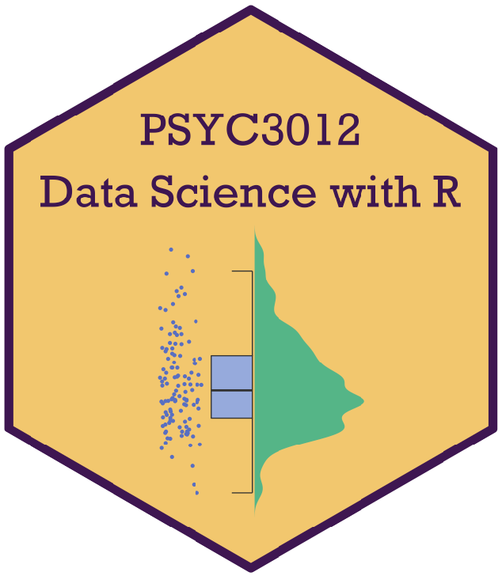

--- 
title: "Data Science with R (PSYC3012)"
subtitle: |
  {width=3in}
author:
- name: Dr Carlos Crivelli
- name: Associate Professsor/Reader in Affective Science and Social Interaction
- name: Division of Psychology (School of Applied Social Sciences)
  email: carlos.crivelli@dmu.ac.uk
  affiliation: De Montfort University
date: ""
site: bookdown::bookdown_site
documentclass: book
bibliography: [book.bib, packages.bib]
link-citations: yes
github-repo: rstudio/bookdown-demo
split_by: section
---

# Introduction {-}

**Data Science with R** (PSYC3012) is a 15-credit optional module that aims to develop students’ research skills relying on three main themes: Open Science, digital literacy, and science communication.

The module covers data wrangling, data visualization, categorical data analysis, general linear models, and robust statistics using R—a free software environment for statistical computing and graphics. Each session is grounded in Open Science best practices to favor reproducibility and transparency in science, following the guidelines of the 2019 Concordat to Support Research Integrity, the UK Reproducibility Network, and the 2016 Concordat on Open Research Data.

Upon successful completion of this module, students should be able to:

  * Recognize, explain, and apply open science best practices following the Concordat on Open Research Data and the UK Reproducibility Network guidelines.
  * Identify and describe the appropriate analytical procedures required to answer research questions related to categorical data analysis and general linear models.
  * Apply R to organize and tidy the data, to model the data, and to generate appropriate data visualizations.
  * Inspect and appraise the outputs generated with R to produce with Rmarkdown a reproducible research report that will communicate the results relying on the principles of transparency and reproducibility in science.

## How to use this book {-}

This book is intended to be the handbook of the optional module **Data Science with R** (PSYC3012); a module delivered for the Psychology undergraduate provisions at De Montfort University (Leicester, United Kingdom). This book includes all the content and reproducible examples that will be delivered in the 2-hour weekly sessions (Term 1, Academic Year 2023-24).

It is recommended to read in advance the corresponding chapters and sections that will be explained in class. Similarly, it is recommended to install **R**, **RStudio**, and the required R packages to work on the examples of this book before attending the first lecture and workshop. Please, read the software installation guidelines before reading the book (Appendix \@ref(appenA)).

## About the Author {-}

[Dr Carlos Crivelli](https://www.dmu.ac.uk/about-dmu/academic-staff/health-and-life-sciences/carlos-crivelli/carlos-crivelli.aspx){target="_blank"} is an Associate Professor/Reader in Affective Science and Social Interaction in the School of Applied Social Sciences at De Montfort University (Leicester, United Kingdom).

After completing a BSc (Hons) Psychology, Dr Crivelli received his MSc and PhD in Methodology of Behavioral and Health Sciences from Universidad Autónoma de Madrid (Madrid, Spain). His research interests focus on three main areas: social influence and emotion science, cross-cultural psychology, and data science. He has published on these topics in journals like [*Trends in the Cognitive Sciences*](https://www.cell.com/trends/cognitive-sciences/fulltext/S1364-6613(18)30029-9){target="_blank"}, [*Proceedings of the National Academy of Sciences, U.S.A.*](https://www.pnas.org/doi/full/10.1073/pnas.1611622113){target="_blank"}, [*Perspectives on Psychological Science*](https://journals.sagepub.com/doi/10.1177/17456916221148142){target="_blank"}, and [*Current Directions in Psychological Science*](https://journals.sagepub.com/doi/full/10.1177/0963721417746794){target="_blank"}.
 
Dr. Crivelli is an Honorary Fellow of the University of Melbourne (Australia), a Fellow of the Higher Education Academy, and a member of the editorial board of [*Nature–Scientific Data*](https://www.nature.com/sdata/){target="_blank"}. He teaches undergraduate and postgraduate courses in Psychometrics and Data Science in R, Personality and Intelligence, and Conceptual Issues and Critical Debates in Psychology, embedding the intercultural dimension, and open and reproducible research into the curriculum. 

