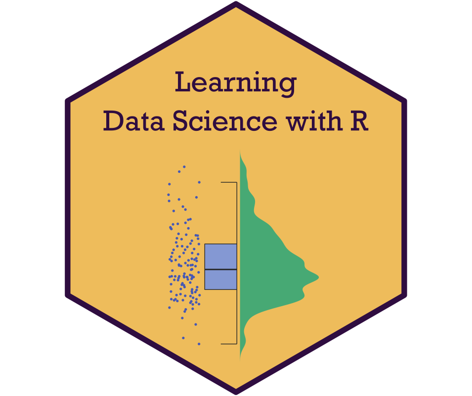

--- 
title: "Learning Data Science with R"
subtitle: |
  {width=3in}
author:
- name: Dr Carlos Crivelli
- name: Associate Professsor/Reader in Affective Science and Social Interaction
- name: Division of Psychology (School of Applied Social Sciences)
  email: carlos.crivelli@dmu.ac.uk
  affiliation: De Montfort University
date: ""
site: bookdown::bookdown_site
documentclass: book
bibliography: [book.bib, packages.bib]
link-citations: yes
github-repo: rstudio/bookdown-demo
split_by: section
---

# Introduction {-}

**Learning Data Science with R** is a book that aims to develop psychology students’ research skills relying on three main themes: Open Science, digital literacy, and science communication.

The book covers Open Science principles, an introduction to R programming and data wrangling, descriptive statistics and data visualization, categorical data analysis, general and generalized linear models, and an introduction to psychometrics using R—a free software environment for statistical computing and graphics. Each chapter promotes the use of Open Science best practices to favor reproducibility and transparency at different stages of research data management process, along with learning key digital literacy skills and science communication competencies.

Upon successful completion of this book, students should be able to:

  * Recognize, explain, and apply Open Science best practices following the 2016 Concordat on Open Research Data and the UK Reproducibility Network guidelines.
  * Identify and describe the appropriate analytical procedures required to answer research questions related to categorical data analysis, general and generalized linear models, and some psychometric models.
  * Apply R to organize and tidy the data, to model the data, and to generate appropriate data visualizations.
  * Inspect and appraise the outputs generated with R to produce with Rmarkdown a reproducible research report that will communicate the results relying on the principles of transparency and reproducibility in science.

## How to use this book {-}

This book is intended to be a handbook used in psychology undergraduate (e.g., in 3rd-year optional modules) and postgraduate (e.g., MRes, MSc Psychological Research Methods) provisions interested in teaching data science with R for psychologists. Each chapter could be delivered in 1-2 hour sessions, with most of the content of the book aligned with a 13-week term delivery.

It is recommended to install **R**, **RStudio**, and the required R packages to work on the examples of this book. Please, read the software installation guidelines before reading the book (Appendix \@ref(appenA1)).

## About the Author {-}

[Dr Carlos Crivelli](https://www.dmu.ac.uk/about-dmu/academic-staff/health-and-life-sciences/carlos-crivelli/carlos-crivelli.aspx){target="_blank"} is an Associate Professor/Reader in Affective Science and Social Interaction in the School of Applied Social Sciences at De Montfort University (Leicester, United Kingdom).

After completing a BSc (Hons) Psychology, Dr Crivelli received his MSc and PhD in Methodology of Behavioral and Health Sciences from Universidad Autónoma de Madrid (Madrid, Spain). His research interests focus on three main areas: social influence and emotion science, cross-cultural psychology, and data science. He has published on these topics in journals like [*Trends in the Cognitive Sciences*](https://www.cell.com/trends/cognitive-sciences/fulltext/S1364-6613(18)30029-9){target="_blank"}, [*Proceedings of the National Academy of Sciences, U.S.A.*](https://www.pnas.org/doi/full/10.1073/pnas.1611622113){target="_blank"}, [*Perspectives on Psychological Science*](https://journals.sagepub.com/doi/10.1177/17456916221148142){target="_blank"}, and [*Current Directions in Psychological Science*](https://journals.sagepub.com/doi/full/10.1177/0963721417746794){target="_blank"}.
 
Dr. Crivelli is an Honorary Fellow of the University of Melbourne (Australia), a Fellow of the Higher Education Academy, and a member of the editorial board of [*Nature–Scientific Data*](https://www.nature.com/sdata/){target="_blank"}. He teaches undergraduate and postgraduate courses in Psychometrics and Data Science with R, Personality and Intelligence, and Conceptual Issues and Critical Debates in Psychology, embedding the intercultural dimension, and open and reproducible research into the curriculum. 

